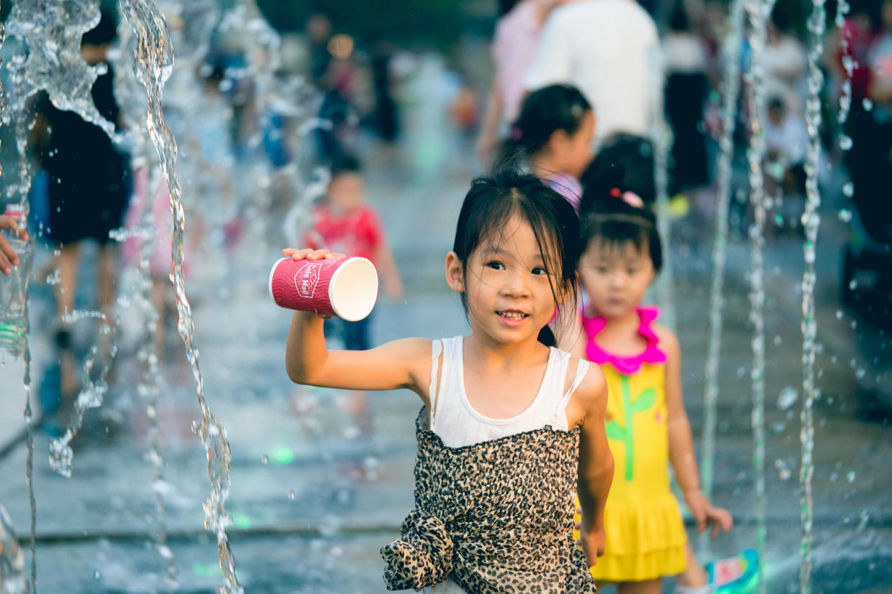

          
            
**2018.07.23**

**拍摄时间：2017.07.08**

**拍摄地点：五道口华联**

这张照片是去年夏天，到五道口华联门口的喷泉拍的。

话说那次也是很偶然，正好路过五道口华联，想去吃金美时。

可是到了才发现已经拆没了，于是到了华联，发现祖母的厨房也没有了。

一桶乱转之后，到了顶层，胡乱吃了个站点披萨，油乎乎的，鸡肉也有股怪味。

失望之余，下楼发现竟然开通了一大片音乐喷泉，一群小孩子在里面跑来跑去。

喵也兴奋地跃跃欲试，我们一起把鞋脱了，光着脚在里里面跑来跑去，夕阳把喷泉水温得暖暖的。

随着水一阵阵地喷出来，孩子们惊叫不已。

喵捡了个水杯，等着喷泉起来时，去接水玩儿。

一转眼，天已经快黑了，虽然浑身都湿透了，但是获得的快乐也是真实的。

**个人微信公众号，请搜索：摹喵居士（momiaojushi）**

          
        