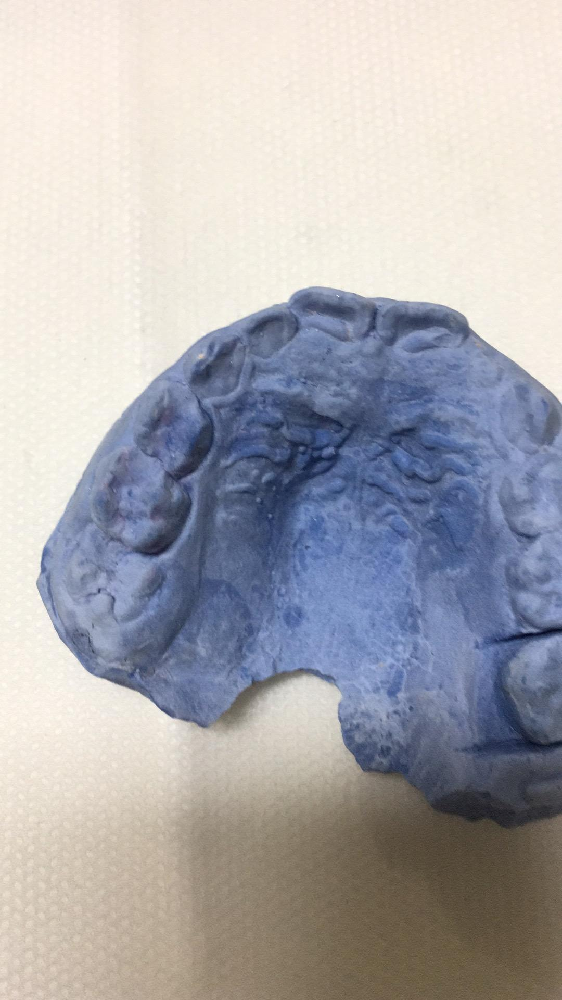

          
            
**2018.07.24**

喵前段时间检查牙齿，大夫发现有一个大磨牙正在往上长，但是上面有一颗乳磨牙挡住了位置。

大磨牙把上面的乳磨牙顶歪了，如果不处理的话，这个要坚持到12岁的乳磨牙就坏了。

于是，大夫建议戴牙套矫正器，把上面的乳磨牙拽到旁边，给下面的大磨牙留出位置。

这样能保住这颗乳磨牙，如果还是坏了的话，就只能种一个牙去占住这个位置，防止其他好牙松散。

这个治疗可真是非常麻烦，第一次是要就咬出一个紫色的牙套，颜色好像灭霸一样。

第二次去的时候，钢牙套已经做好了，勾住了另一边的一颗牙，整体往另一边拽乳磨牙。

据大夫说，可能是要戴3个月，随时有问题都可以直接找大夫处理。

回家以后，说话会有一点大舌头，非常有趣。

不过，第二天，另一侧的挂钩把口腔磨破了点，不太舒服。

但是只要一玩儿起来，小人儿就觉不出来了。

之前看过很多人戴牙套，但今天才真正看到了带牙套的苦。

**个人微信公众号，请搜索：摹喵居士（momiaojushi）**

          
        