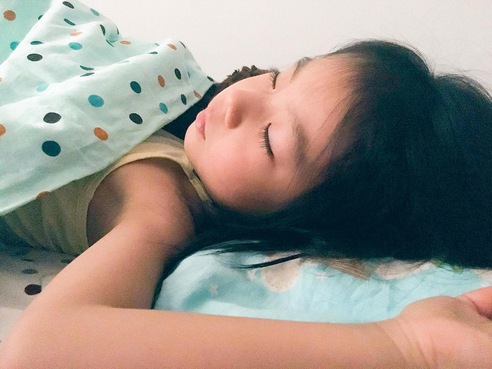

          
            
**2018.07.27**

***有的小朋友对我说不想上小学，因为减法太难了，其实小学里有趣的事可多了，包括减法在内。***

这次我们说一说上小学的中午休息吧。

我上的第一个小学，离家非常近，只有几十米远，不过家里没有人，所以只能带饭去学校吃。

后来，转学后里奶奶的单位近，所以有时候可以去奶奶食堂吃饭，但是大部分时间还是在教室吃饭。

因为吃完饭，可以赶紧写作业，午休的时间，基本都被用来写作业了。

写作业的时候，其他同学有的趴一会儿，离家近的回家睡觉了（通常会睡过头，下午第一节课迟到被老师批评），还有些会聊天，聊到搞笑的地方，大家哄堂大小。

小学的时候精力真是充沛，好像从来不需要午休，抓紧时间写完作业，晚上就可以看书、看电视啦。

所以，午休其实就是午不休，抓紧时间喽。

**个人微信公众号，请搜索：摹喵居士（momiaojushi）**

          
        