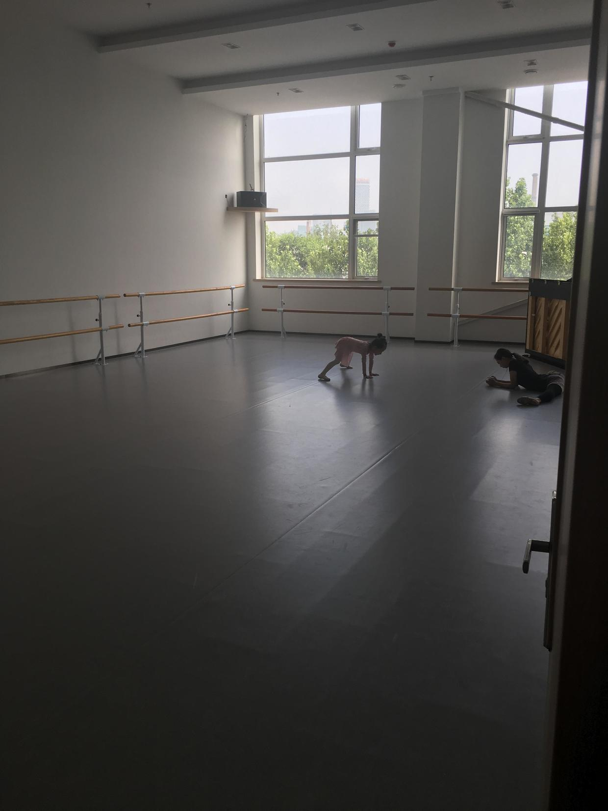
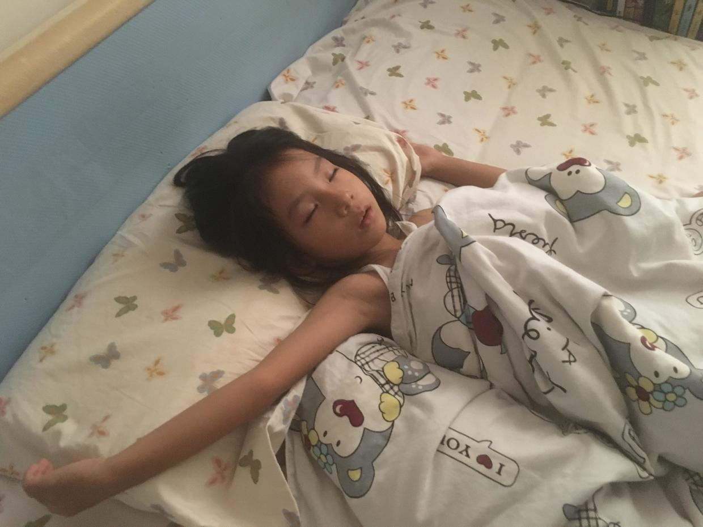
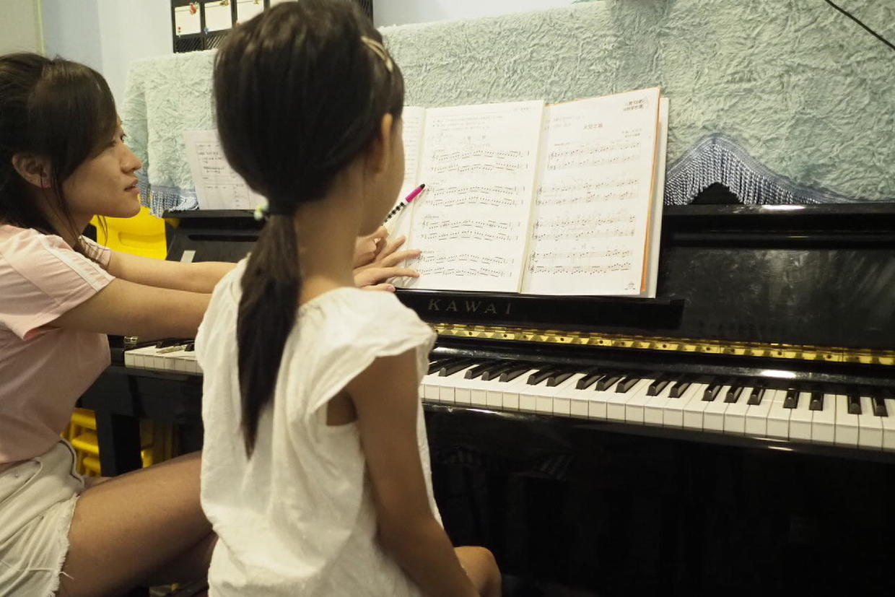

          
            
**2018.07.28**

周六啦，天气非常闷热。

一早起床，吃过早饭，去上芭蕾课。

今天到得很早，只有喵一个人，老师也到了，两个人对着横叉热身。

下周开始，芭蕾课就要有3周的休假。

中午和姥姥姥爷视频，然后看一会儿《银河护卫队2》，吃午饭。

好久没吃麦当劳了，今天中午尝了一下新出的脆薯，味道很好。

然后就是睡午觉，张着嘴，睡得可香了。

下午去上钢琴课。

封面

音阶和哈农还是要每天都练，积少成多。

《天空之城》可以再快一点，也到了加踏板的时候。

一级曲目练了《鸡妈妈和她的孩子们》，也开始练《快乐的女战士》，这首曲子里出现装饰音了。

出了钢琴教室，天有点云，顿时凉快了一些。

2周的阴雨过后，又恢复了惯常的闷热天气。

**个人微信公众号，请搜索：摹喵居士（momiaojushi）**

          
        