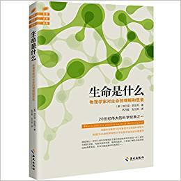

          
            
**2018.08.01**

薛定谔的演讲录，据说直接启蒙了后来发现DNA双螺旋结构的年轻人。
<h2>2018.03.31（周六）</h2>
<h3>《生命是什么》 - 01</h3>
>序言

自由的人绝少思虑到死：他的智慧，不是死的默念，而是生的沉思。——斯宾诺莎《伦理学》第四部分，命题67

生命是什么
>PartA生命是什么

本书是一位理论物理学家对大约400名听众所作的一次公开演讲。

薛定谔的演讲
>较少使用数学推理，并不是说这个问题简单；相反，这个问题太过复杂以至于无法用数学语言来表达。

生命过于复杂
>活细胞的最重要部分是染色体纤丝，我们也可以称之为非周期性晶体。直到现在，我们遇到的大多是周期性晶体。

在一个普通的物理学家眼里，周期性晶体就已经是十分复杂的物质了——它们构成的极具吸引力和最复杂的结构使得无生命的自然界变幻莫测。

然而，如果拿它们与非周期性晶体相比的话，其复杂程度便逊色了许多。两种不同物质的结构差别，就像是糊墙纸和刺绣的不同；一个是重复同一的花纹，一个是绚丽多彩的刺绣。

活细胞是非周期性晶体，比自然界周期性晶体还复杂
>一般而言，突变的发生往往都是有害的，只是由于它们是潜在的，因而自然选择一直没有消除它们。从某种程度上来说，长时间积累起来的有害突变是不会立刻造成明显的损害的。不幸的是，它们一定会把这种有害的基因传递给后代中的一半个体。

突变往往有害
>只有具有同样有害的隐性基因的个体互相杂交，后代的身上才会明显地表现出这种有害的危险。

近亲结婚危险
<h2>2018.04.01（周日）</h2>
<h3>《生命是什么》 - 02</h3>
>有一种比较乏味的建造方式，是同一种结构在空间的三个方向上不断重复。正在生长中的晶体就是以这种方式建造起来的。

周期性晶体
>还有另一种方式能够改变第一种方式的枯燥乏味风格，那就是有机分子在其中发挥着关键作用。它是不用那种乏味的重复来建造逐渐扩大的集合体。在越来越复杂的有机分子里，单个的原子和原子团都各自发挥着作用。这与在周期性结构那里的原子或原子团是不相同的。以这种方式来逐渐扩大的集合体，我们可以称它为非周期性的晶体或固体。

非周期性晶体，有机分子发挥作用
>我们前文论述过的同分异构，可能的原子排列数量很大以至于一个复杂的“决定性”系统的所有特征在一个很小的空间范围内即被囊括。于是，在这种结构里，只需要很少的原子就可以衍生出无穷的排列组合。

遗传物质
>那么，生命有机体是如何避免衰退到平衡的呢？毫无疑问，显然是靠吃、喝、呼吸以及（植物的）同化。生物学中有一个专门的术语叫“新陈代谢”，说的就是这个意思。这个词来源于希腊字，意思是交换或变动。

生命在于什么？
>最初大部分人都认为是指物质的交换，其实这种看法是错误的。因为我们知道，生物体中的氧、氮、硫等任何一个原子与环境中的同类原子都是一样的，那么把它们进行交换又有什么意义呢？

不是为了物质交换
>后来有人认为能量是我们赖以生存的基础。然而，一个成年有机体所含的物质与所含的能量都是固定不变的。既然体外一个卡路里与体内一个卡路里的价值是相等的，那么，这样的单纯交换是为了什么呢，能有什么样的益处呢？可见，能量说也是一个荒唐的结论。

也不是能量
>自然界中的每一个过程、事件以及突发事变等等，它们在发生的过程中意味着在其中的与之相对应的那部分熵在增加。

因此，一个生命有机体无时无刻不在生产着熵或者是在增加正熵，同时它们不断趋近熵的最大值，在这一缓慢过程之后就是生命有机体的危险状态，即死亡。

那么，如何才能摆脱死亡，一直保持生命的存在状态？从环境里孜孜不倦地汲取负熵恐怕是唯一的办法了。

生命在于获取负熵，减少自己无序性，增加自己有序性
>熵是什么？首先声明的是，这个物理量是可以进行测量的，而不是一个模糊的概念或思想。

比如你熔解一种固体，它熔化时所需要的热量除以熔点温度就是它的熵增加量。

前文所举的糖和水分子的混合就是后一种无序。玻耳兹曼公式在这个例子中算是得到了完美阐释。随着糖在水中的慢慢散开，系统的无序性D也随之增加。于是熵也随着增加。

熵是混乱
>我们在前文曾说过：“生命以负熵为生”，这就好比生命有机体借助于外界的负熵来消除它体内的正熵的增加量。

如果觉得“负熵”这种公式表达比较拗口的话，我们可以这样来表达它：取负号的熵正是序的一个量度。

我们可以知道有机体使其自身维持在一个有序水平的办法，无一不是从外界的环境中汲取这样的序。

高等动物完全就是汲取序来维持生命的。这是由于作为它们食物的不同复杂程度的有机体的状态是极为有序的。

高等动物吃了这些食物后，排泄出来的是大大降解的物质；当然并没有完全降解，因此这些物质中含有一定量的序，因此植物还可以利用它。

吸收负熵，排出熵
>为什么我们赖以生存的不是木炭或者金刚石矿浆，而是“复杂性有异的有机物的非常有序状态中”的物质？

这个问题可以如此证明：在燃烧和反应的过程中，煤炭会产生大量的热；通过将热散发于周围环境，由于反应而增加的很多的熵就从这个系统中去掉了，由此达到了与此前基本一致的熵的状态。

我们的食物中含有的能量的确至关重要，我不应嘲笑菜单标明食物热量的做法。我们的身体消耗的机械能，以及我们不断向四周散发的热，都要求我们必须补充能量。而散发热这个行为也是我们生存必不可少而非可有可无的，因为正是靠了这个方式，我们才能去掉生理过程中不断在产生的剩余熵。

通过摄入食物，获取负熵
>PartB意识和物质

生物体的学习虽然与意识紧密相关，但是它对学习是怎样发生的却处于一种无意识的状态。

学习是无意识

**个人微信公众号，请搜索：摹喵居士（momiaojushi）**

          
        