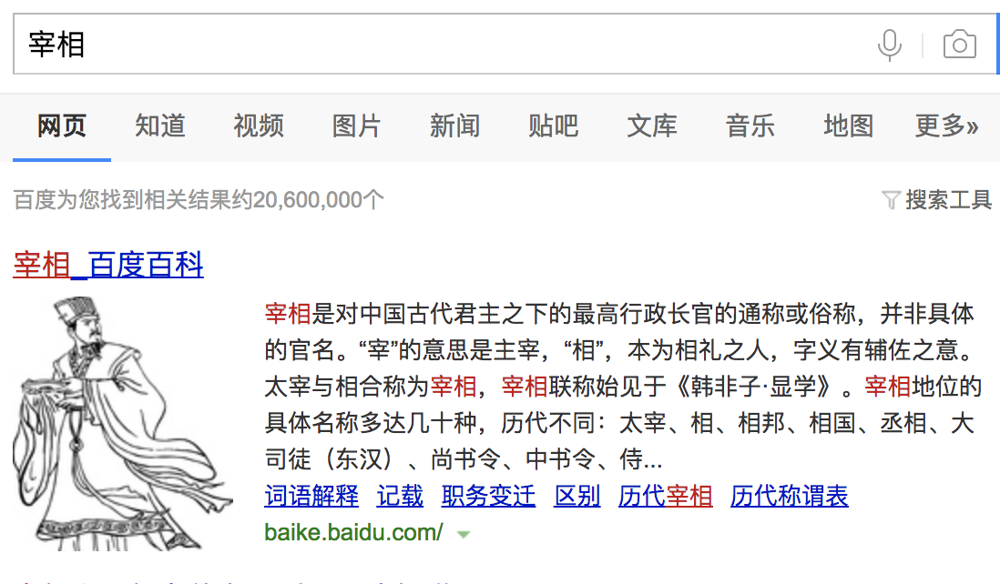

          
            
**2018.08.02**

>宰相是对中国古代君主之下的最高行政长官的通称或俗称，并非具体的官名。“宰”的意思是主宰，“相”，本为相礼之人，字义有辅佐之意。太宰与相合称为宰相，宰相联称始见于《韩非子·显学》。
宰相地位的具体名称多达几十种，历代不同：太宰、相、相邦、相国、丞相、大司徒（东汉）、尚书令、中书令、侍中、尚书左仆射、尚书右仆射、同平章事、内阁大学士（明朝）、军机大臣、总理（清朝末期）等等。

最近听赵冬梅讲中国史，提到了宰相制度。

宰相只是一个统称，各个朝代都有具体的官职，来对应到宰相。（只有辽例外）

最后，不得不提的就是明代废除宰相，所有大小事务全由皇帝亲自处理。

真是董事长和总经理一肩挑。

虽然后来有了内阁和军机处，但是缺少了监督官员的职能后，就不在是完整意义的宰相，只能算是行政宰相了。

**个人微信公众号，请搜索：摹喵居士（momiaojushi）**

          
        