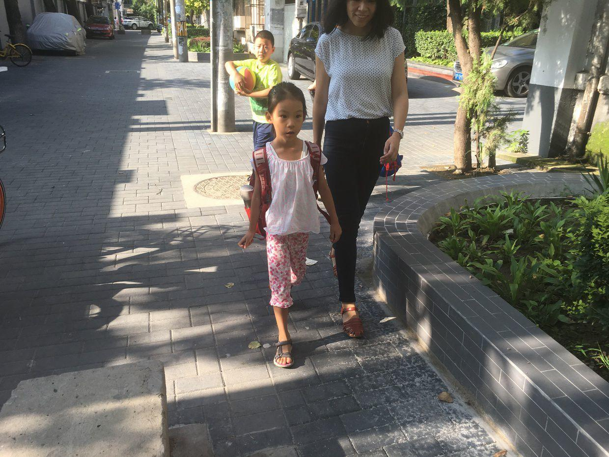
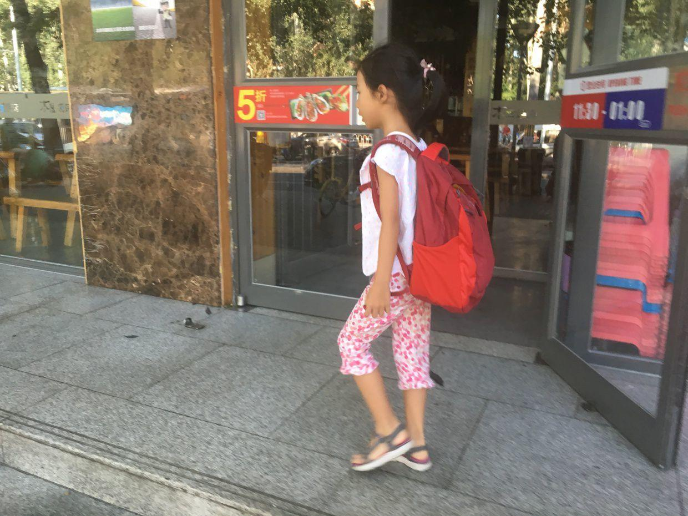
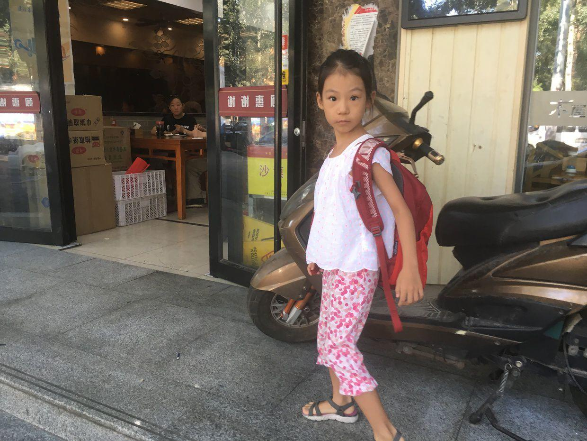
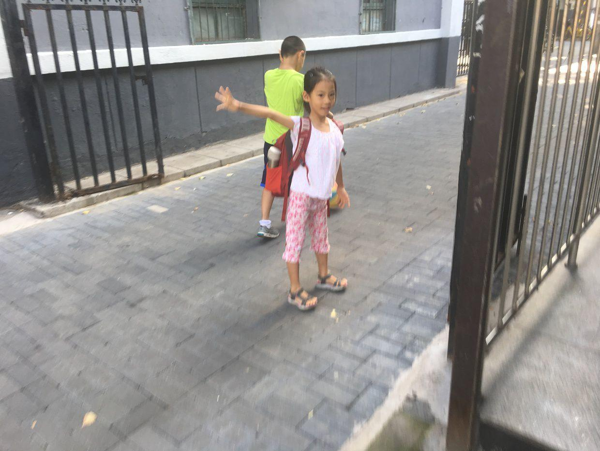
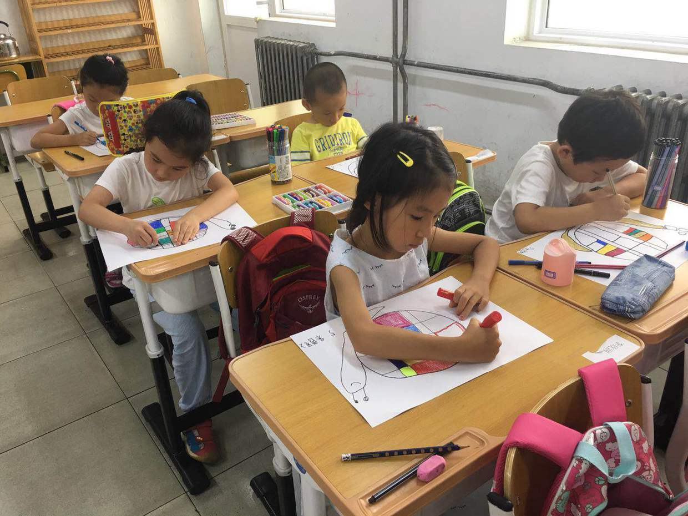
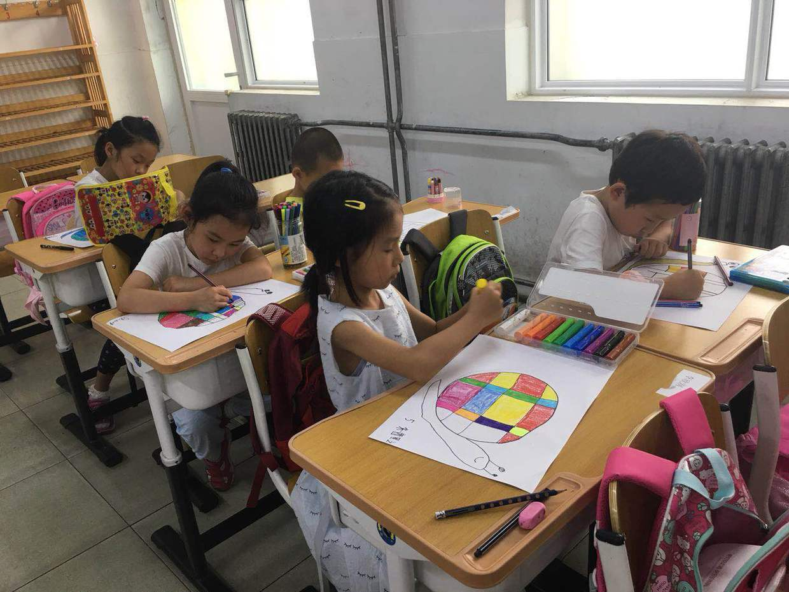
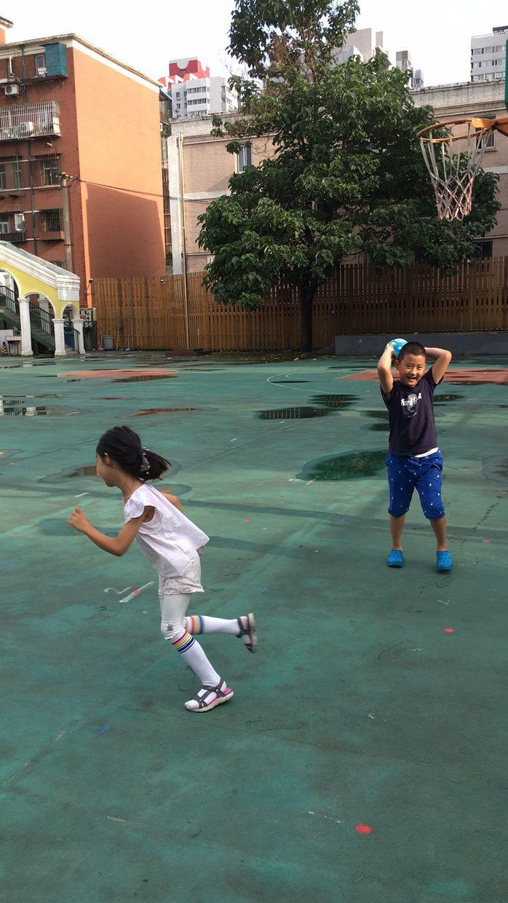
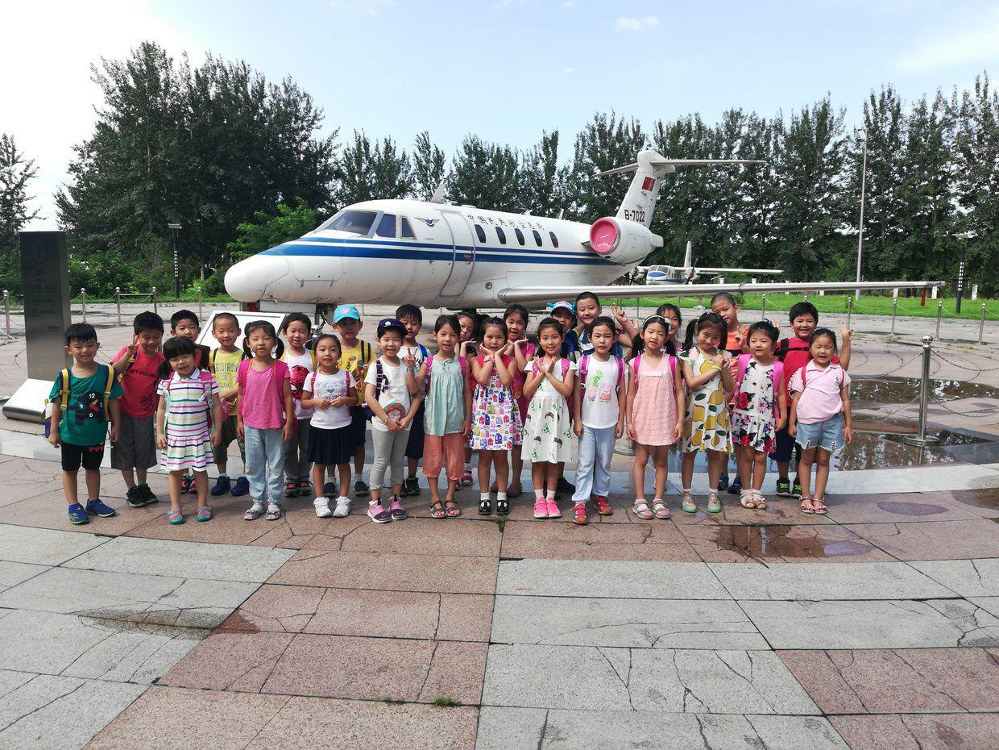

          
            
**2018.08.07**

转眼间，喵已经上了很久学前班了。

一早上7点开始，10分钟起床。

7:10穿好衣服，出屋吃饭。

7:25左右出门。

车停到一半的路边，然后一起走过去。

路上还会碰到自己的同学。

一路都背着书包自己走。

标准的小学生的样子。

拐进学校的巷子里。

在学校里画画，拿笔姿势还要调整。

带了一大盒子水彩笔。

放学后，在操场上和同学们一起追球。

每个周三，学校还会组织参观博物馆，这次是去机场边上的民航博物馆。

之前还觉得可能会比较难，但是现在看起来适应的很快。

早上起床不用反复催促，吃饭也能按时。

在课上基本能完成作业，回家还能给我们绘声绘色地讲出来。

更厉害的是，很快就交到了新朋友，互相赠送礼物。

非常好的开始。

**个人微信公众号，请搜索：摹喵居士（momiaojushi）**

          
        