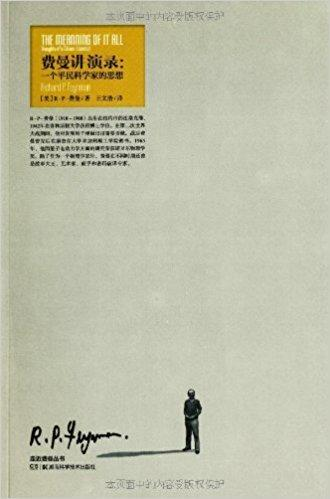

          
            
**2018.08.08**

非常通俗，非常推荐。
<h2>2018.04.02（周一）</h2>
<h3>《费曼演讲录》 - 01</h3>
>1.科学的不确定性

今晚我在这里要描述的都是些古老的观念。这些观念差不多早在17世纪就被哲学家们谈论过。那么为什么还要重复讨论这些观念呢？这是因为每天都会有新一代的人出生。因为人类历史上形成的这些伟大观念需要我们特意地、明确地、一代一代地传承下去，否则就会失传。

重要的事要不停地重复
>叶绿素是植物进行氧处理过程的重要的化学物质。它具有正方形结构，这种漂亮的环结构称为苯环。与植物相去甚远是像我们人这样的动物，而在我们人体的含氧系统即血液中，血红蛋白也具有同样有趣而奇异的正方形环结构。只不过环的中心是铁原子而不是镁原子，因此它们不是绿色而是红色的，但它们的环结构完全相同。

叶绿素和血红蛋白
>女孩子在做剧烈的跳绳运动时，体内会发生什么变化呢？血被泵出，交错连接的神经系统会很快将肌肉神经的反应回馈至大脑，说，“现在我们已经触及地面，赶紧提高血压，否则就要伤到脚后跟了。”当女孩上下跳跃时，还有另一组肌肉系统在工作，与之相连的另一组神经在数数：“一，二，三，奥利里，一，二，……”她在做这些的同时，也许还在对看着她的生理学教授微笑。这也是泵血和肌肉神经反应的过程！

人体完美地运转
>法拉第演讲的要点是，不管你观察什么，只要你观察得足够仔细，你就会涉及整个宇宙。

观察很重要
>我听到有人说德国对犹太人的灭绝进行得很“科学”，其实这与科学一点都不沾边，只不过是强调进行得很彻底。

因为这其中不涉及先进行观察然后检查结果从而确定事情的问题。

科学和彻底
>对观察结果进行解释就是其中的一个例子。例如有个很著名的笑话是说一个男人向他的朋友抱怨说，他发现了一个神秘的现象：他农场里的白马要比黑马吃得多。为此他很担心，而且对此感到不解。后来他的朋友提醒他，可能他养的白马要比黑马多。

观察后如何解释结果很重要
>顺便说一句，我们有各种可进行检验的法则这本身就是个奇迹。有可能找到一条法则，如万有引力的平方反比律，就是某种奇迹。我们对这条法则可能并不完全知其所以然，但它能提供预测的可能性——这意味着它能告诉你在你还没进行的实验中你能预期会发现什么。

结果要能检测
>2.价值的不确定性

宗教有许多方面。它回答了各种问题。不过我在此要强调的是如下三个方面。

第一个方面，是它告诉了我们万物是什么，它们来自何处，人是什么，上帝是什么以及上帝有什么特性等。

就这里的讨论而言，我想将这些称之为宗教的形而上的方面。

接着宗教告诉我们如何做人。我这里不是指那种在宗教典礼或仪式上的行为规范等，而是指一般意义上做人的道德方式。我们可将它称为宗教的伦理方面。

最后，人是脆弱的。需要具有正确的良知才能确保产生正当的行为。

宗教强有力的一个方面正是它的灵感作用。宗教激励人行为端正。

现在，从宗教看来，宗教的这三个方面是非常紧密地相互联系的。首先，事情通常是这样的：上帝的话就是道德价值标准；其次，上帝的话将宗教的道德伦理和形而上的方面联系起来；最后，上帝的话会激发起灵感，因为如果你是在为上帝服务，服从上帝的旨意，你就会以某种方式通达宇宙，你的行为就会在更大的世界上显示出其意义，而这正是灵感的方面。因此，这三个方面是高度整体性的，是相互关联的。困难的是，科学偶尔会与前两个方面，即与宗教伦理与形而上学方面相冲突。

宗教的三个方面
>历史上的一次大斗争发生在这样一种时刻：人们发现，地球不仅绕自身轴旋转，而且还绕太阳旋转。

另一次大冲突是人们发现人可能是从动物进化来的。

但结果却是其道德观并没有明显变化。你看到地球围绕太阳转，是的，但那又怎么样？它能告诉我们“有人打我一边脸时，把另一边给人家打”是好还是不好？

宗教和科学的大冲突
>西方文明，在我看来，是建立在两大遗产基础之上的。一个是科学的冒险精神——

另一个伟大遗产是基督教伦理——建立在爱的基础上的行为，四海之内皆兄弟，个人的价值，精神的谦卑。

西方文明，智力的谦卑和精神的谦卑
>技术的发展，即科学的应用，可以在没有自由的条件下进行。我们之所以说苏俄落后，是因为它还不懂得政府的权力需要限制。

技术不需要自由

**个人微信公众号，请搜索：摹喵居士（momiaojushi）**

          
        