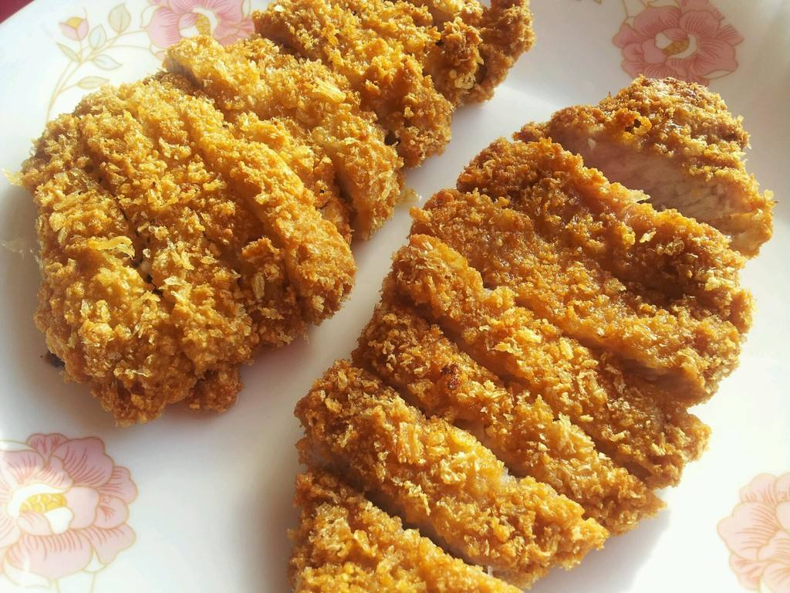

          
            
**2018.08.09**

本篇回忆一下第一次吃炸猪排的情景。

第一次吃炸猪排，是在小学3-4年级左右。

当时晚上放学在家，母亲主动跟我说今天晚上要吃炸猪排。

我从来没听说过这个，但是知道是猪肉，就绝不会反对。

母亲把做好的猪排端上桌，并不像现在饭馆里看到，金黄色，切成长条的。

而是，综黑色有点糊，切成了小方块。

为了正式，特地准备了一个叉子放在盘子边。

接下来，母亲继续做别的菜，而我已经完全被炸猪排的香气吸引。

拿起叉子，尝了一块。

从来没有吃过这么好吃的东西，于是又叉了一块。

等母亲端第二道菜来的时候，一整盘猪排都被我吃完了。

作为一个恪守封建伦理道德的人，在父母还没上桌前，竟然把这么一盘肉自己吃完了。

很难想象，当年竟然能做出这种大逆不道的事。

现在想象，吃猪排的时候，脑子已经不再想任何其他事了。

这么多年，似乎再没遇到过这样的美味了。

这一盘子肉吃完，当晚就发烧了。

高温的时候，母亲问我想吃点什么，我还倔强地说：
>炸猪排。

后来，发烧后想吃炸猪排，似乎成了一个美丽的条件反射。

**个人微信公众号，请搜索：摹喵居士（momiaojushi）**

          
        