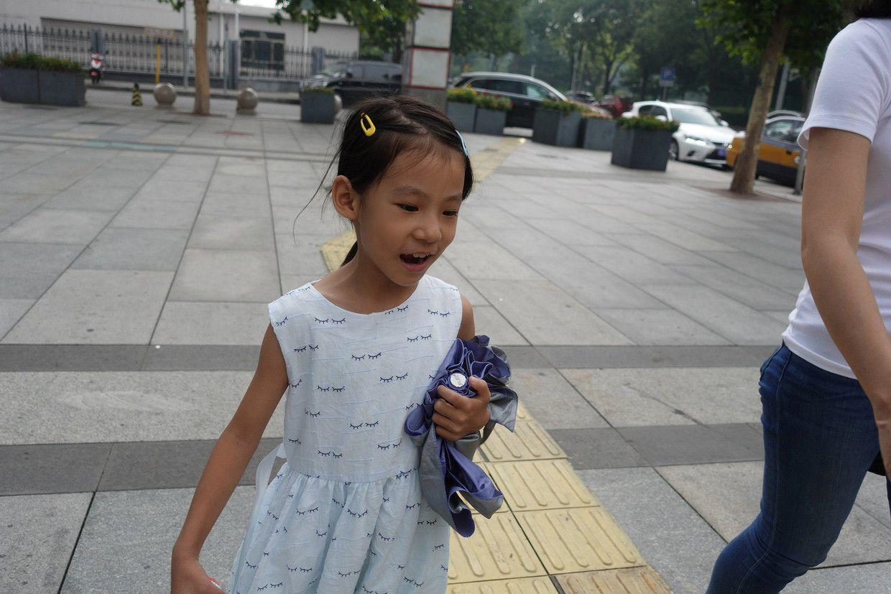
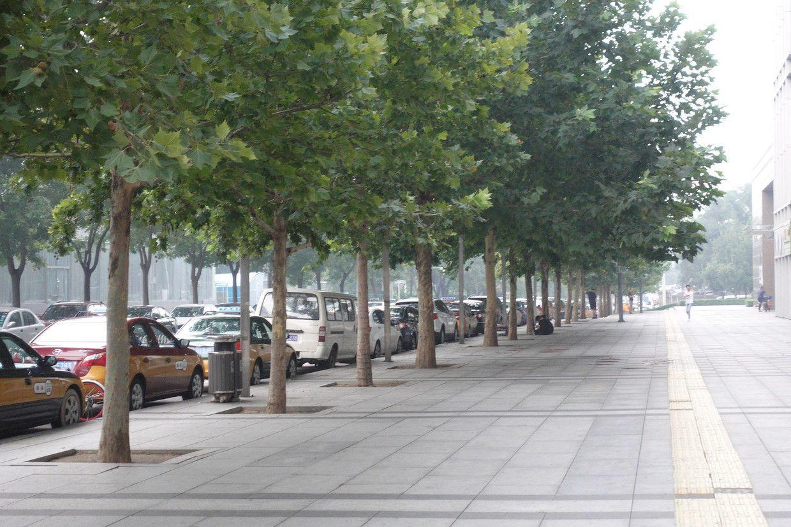
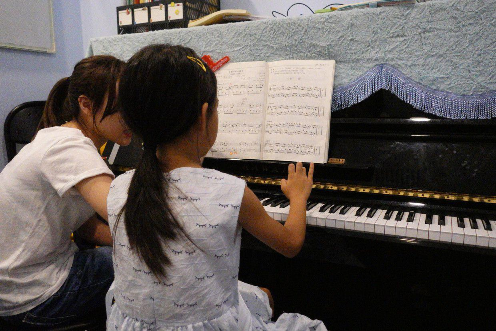

          
            
**2018.08.11**

周六啦，一大清早下起了大雨。

早上吃过早饭，开始练琴。

总是碰到难点就想跳过去，而且练得次数也少，总是奇怪为什么自己弹不对，就是因为不熟。

练完琴，上午和姥姥姥爷一起视频聊天。

快到无法时间了，开始看中国好声音，喵也很感兴趣。

吃过午饭，睡个大觉，下午去上钢琴课。

带上了一把伞，有点下起小雨了。

虽然早上下了一场雨，但还是很闷热，雾蒙蒙的。

钢琴课上得还不错，老师详细指导了难点部分。

上完钢琴课，去超市买点早饭，开天气又要下雨，赶紧回家了。

回家继续看会儿电视放松一下，吃过晚饭，早点休息。

明天就要和爷爷奶奶去南戴河玩儿了。

离开学还有一段时间，正好可以再玩儿一周，等开了学就要忙起来了。

**个人微信公众号，请搜索：摹喵居士（momiaojushi）**

          
        