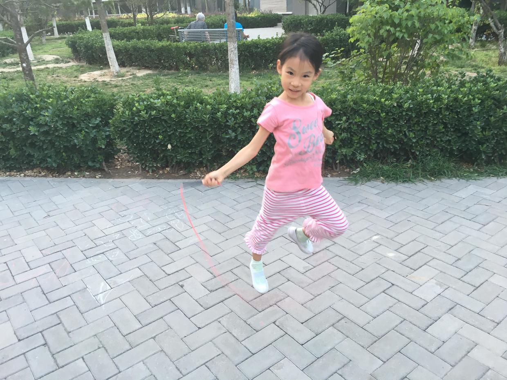

          
            
**2018.08.14**

前段时间开始练跳绳，喵基本已经熟悉绳子了。

于是我们每天开始规律地在楼道里练习跳绳。

一开始的计划是一口气跳60个，后来发现对于她来说很难，中间要断好几次，而且累得呼哧带喘。

于是开始调整，每次跳15个，争取不坏，但是总还是老中断。

本着循序渐进的精神，我们改成了调下一顿一下的方式，连续跳15下，坏了就重新开始。

这下有些意思了，基本每次都能完成，而且不坏的话，还会主动继续跳。

每天，连续跳3个15跳，每次结束后，我们一起双人跳。

一开始的时候，喵总要抓着我的裤子，经常把我的裤子拽掉，后来渐渐能掌握好距离，可以完成5次了。

现在从15也增加到20了，顿着跳一次20个不坏。

继续一点点努力，争取继续新的进步。

>生活中，我们应该像登飞来峰的王安石一样。
飞来山上千寻塔，闻说鸡鸣见日升。
不畏浮云遮望眼，自缘身在最高层。

**个人微信公众号，请搜索：摹喵居士（momiaojushi）**

          
        