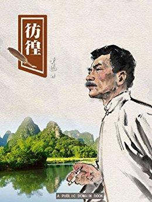

          
            
**2018.08.15**

每篇都提现了彷徨，但是似乎只有《祥林嫂》写得最好。
<h2>2018.04.03（周二）</h2>
<h3>《彷徨》 - 01</h3>
>祝福

一见面是寒暄，寒暄之后说我“胖了”，说我“胖了”之后即大骂其新党。但我知道，这并非借题在骂我：因为他所骂的还是康有为。但是，谈话是总不投机的了，于是不多久，我便一个人剩在书房里。

寒暄之后，骂革命党，和骂天气一样
>“就是——”她走近两步，放低了声音，极秘密似的切切的说，“一个人死了之后，究竟有没有魂灵的？”

“也许有罢，——我想。”我于是吞吞吐吐的说。“那么，也就有地狱了？”“阿！地狱？”我很吃惊，只得支梧着，“地狱？——论理，就该也有。——然而也未必，……谁来管这等事……。”

“那么，死掉的一家的人，都能见面的？”“唉唉，见面不见面呢？……”这时我已知道自己也还是完全一个愚人，什么踌蹰，什么计画，都挡不住三句问。我即刻胆怯起来了，便想全翻过先前的话来，“那是……实在，我说不清……。其实，究竟有没有魂灵，我也说不清。”

进步青年被问得哑口无言
>人们都说鲁四老爷家里雇着了女工，实在比勤快的男人还勤快。到年底，扫尘，洗地，杀鸡，宰鹅，彻夜的煮福礼，全是一人担当，竟没有添短工。然而她很满足，口角边渐渐的有了笑影，脸上也白胖了。

来当长工，还白胖了
>她到年底就生了一个孩子，男的，新年就两岁了。我在娘家这几天，就有人到贺家墺去，回来说看见他们娘儿俩，母亲也胖，儿子也胖；上头又没有婆婆；男人所有的是力气，会做活；房子是自家的。——唉唉，她真是交了好运了。”

嫁到山里，还挺幸福，有了儿子
>她未必知道她的悲哀经大家咀嚼赏鉴了许多天，早已成为渣滓，只值得烦厌和唾弃，但从人们的笑影上，也仿佛觉得这又冷又尖，自己再没有开口的必要了。她单是一瞥他们，并不回答一句话。

悲剧被咀嚼成渣子
>在酒楼上

“一斤绍酒。——菜？十个油豆腐，辣酱要多！”

豆腐和辣酱
>可以眺望楼下的废园。这园大概是不属于酒家的，我先前也曾眺望过许多回，有时也在雪天里。但现在从惯于北方的眼睛看来，却很值得惊异了：几株老梅竟斗雪开着满树的繁花，仿佛毫不以深冬为意；倒塌的亭子边还有一株山茶树，从暗绿的密叶里显出十几朵红花来，赫赫的在雪中明得如火，愤怒而且傲慢，如蔑视游人的甘心于远行。

我这时又忽地想到这里积雪的滋润，著物不去，晶莹有光，不比朔雪的粉一般干，大风一吹，便飞得满空如烟雾。……

废园
>其间还点菜，我们先前原是毫不客气的，但此刻却推让起来了，终于说不清那一样是谁点的，就从堂倌的口头报告上指定了四样菜：茴香豆，冻肉，油豆腐，青鱼干。

遇到友人，要加菜
>堂倌送上账来，交给我；他也不像初到时候的谦虚了，只向我看了一眼，便吸烟，听凭我付了账。

静等着别人付账

***最近喜欢的诗***
>唐伯虎的白日升天图里的题诗，描述了虫洞
只见白日升天去
不见青天落下来
有朝一日天破了
众人齐喊啊怪怪

**个人微信公众号，请搜索：摹喵居士（momiaojushi）**

          
        