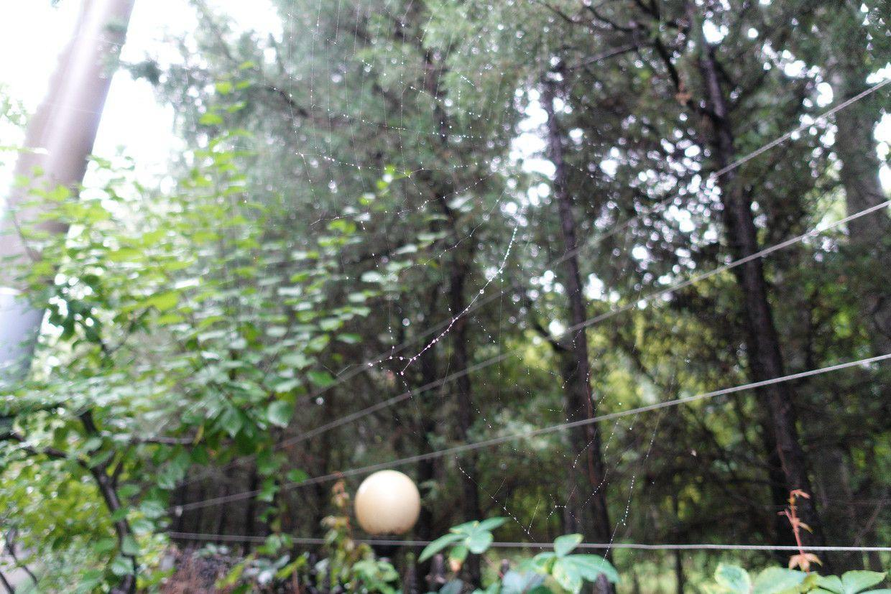

          
            
**2018.08.18**

周末啦，夜里下起了雨。

早上起床，气温非常低，一下子进到秋天。

早上出门，拍了一下反光镜。

一路上都能看见天边的乌云，一阵阵地再来点小雨。

路过了壮观的科技馆的球幕影院。

阴云密布，远处确实晴天。

路边挂满雨滴的蜘蛛网。

突然出来一株倔强的小树。

雨后的绿叶。

去超市，买了不少东西，竟然还凭小票送了一个大西瓜。

回到家，把买的牛肉炖上，准备晚上要做的菜。

下午喵和爷爷奶奶准备回来了，据说明天会有大暴雨，所以只好提前行程。

小学的老师昨天打来电话，通知了分班情况，并且要做下周末家访的准备。

想一想，老师们真是辛苦，一个班里几十个学生，都要一个一个去家访，真是一个宏大的工程。

即将开始新的小学生生涯啦。

***最近喜欢的诗***
>唐伯虎的白日升天图里的题诗，描述了虫洞
只见白日升天去
不见青天落下来
有朝一日天破了
众人齐喊啊怪怪

**个人微信公众号，请搜索：摹喵居士（momiaojushi）**

          
        