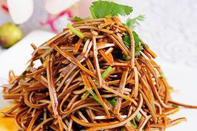

          
            
**2018.08.23**

前几次都回忆了吃东西的愉快经历，这次就回忆一次不那么愉快的吧。

还在上小学时，放学后是用来疯跑的时间。

尤其是夏天，天黑得很晚，在外面和小朋友们一起跑到看不见彼此才会回家。

走进楼里，这时才发现肚子已经叽哩咕噜叫个不停。

一路跑上楼，每层都传出各家饭菜的香味，真是让人遐想，肘子、带鱼、青椒肉丝的味道，实在是让人期待。

进了门，父母正在炒最后的菜。

我去厨房洗手，看见桌上摆了一个白盘子，里面盛的是满满一盘纯的酱肉炒肉丝。

只有纯纯的肉，没有任何绿菜来添乱。

看着这盘肉，我心潮澎湃，快速洗完手，做到桌旁准备吃饭。

一筷子下去，放进嘴里，这个世界崩塌了。

怀着满口肉的期待，下了嘴竟不知是什么。

父母说，今天特意做了酱油豆腐丝。

最好的美味，总是存在想象之中啊。

***最近喜欢的诗***
>唐伯虎的白日升天图里的题诗，描述了虫洞
只见白日升天去
不见青天落下来
有朝一日天破了
众人齐喊啊怪怪

**个人微信公众号，请搜索：摹喵居士（momiaojushi）**

          
        