          
            
**2018.08.25**

周六啦，一早起床，吃过早饭，赶紧去上芭蕾舞课。

到教室很早，只有一个同学来了，于是进屋去做准备活动。

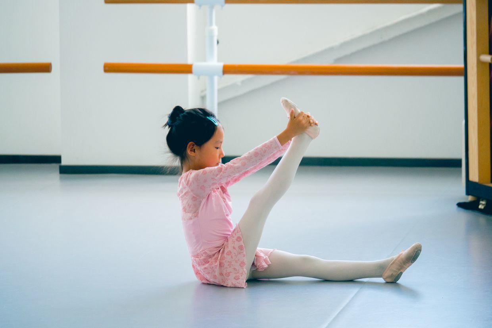

开心的样子。

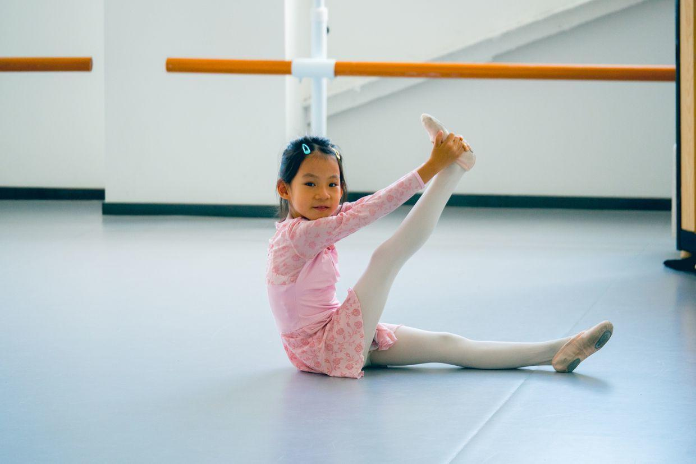

看着我笑，一不小心翻过去啦。

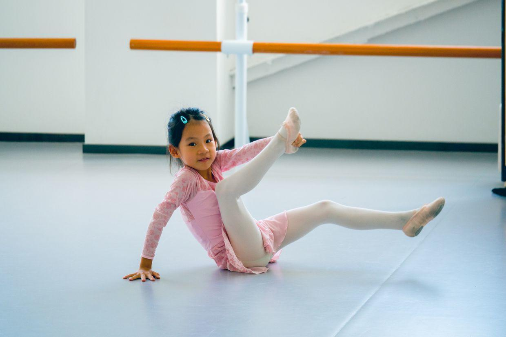

自己也哈哈笑起来。

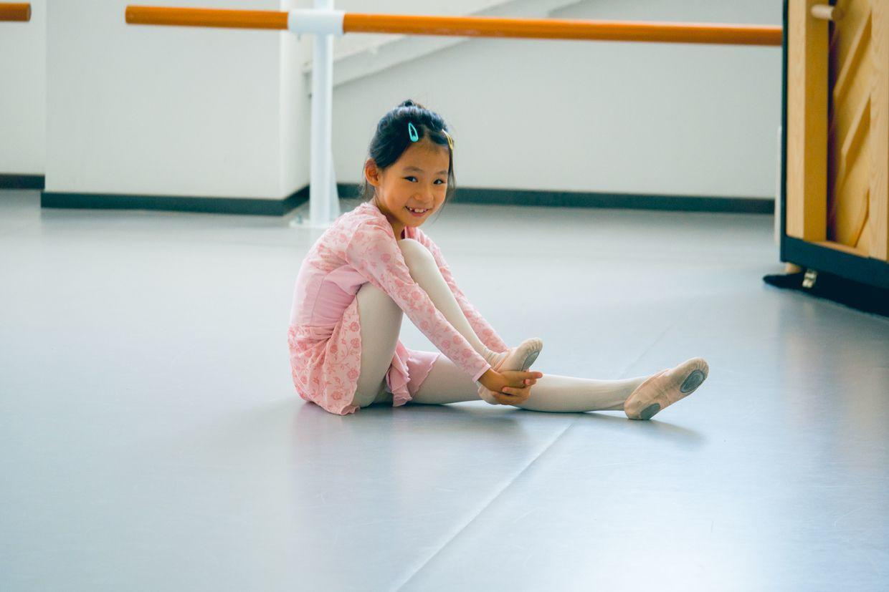

动作很标准，表情也很标准。

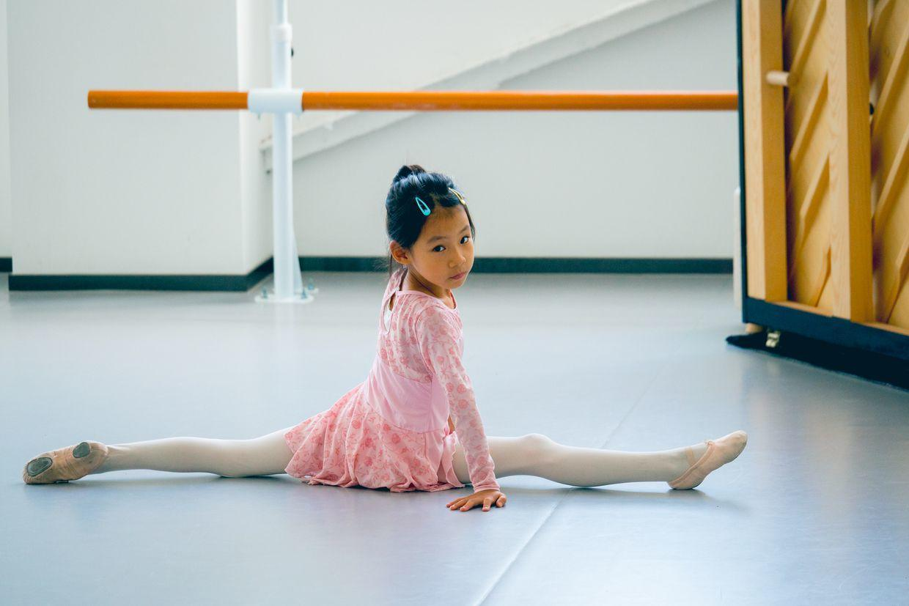

这个动作很有创意。

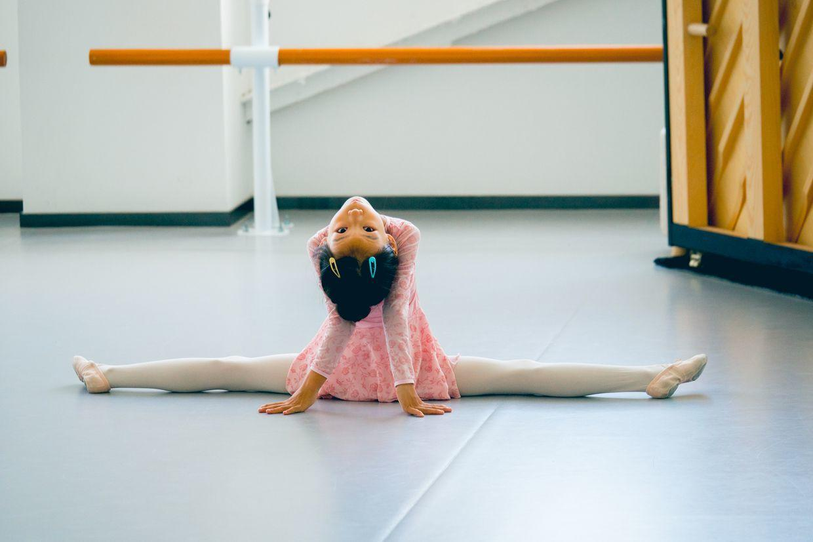

做一个可爱的小动作。

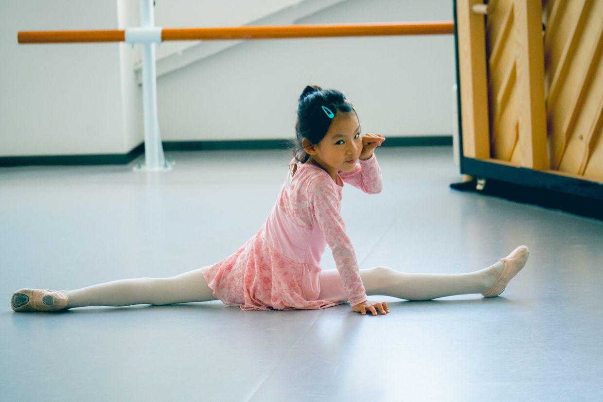

老师来啦，同学们都在准备竖叉。

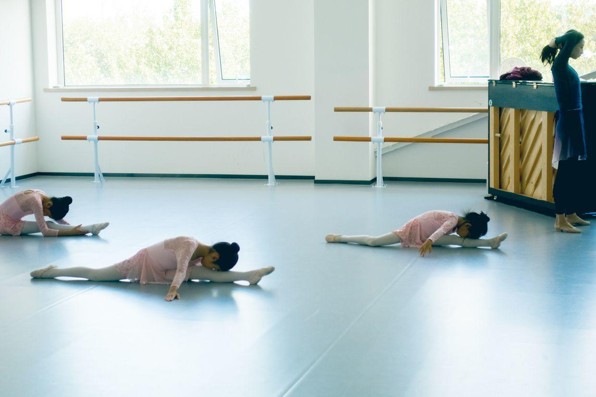

太阳很足，绿意盎然。

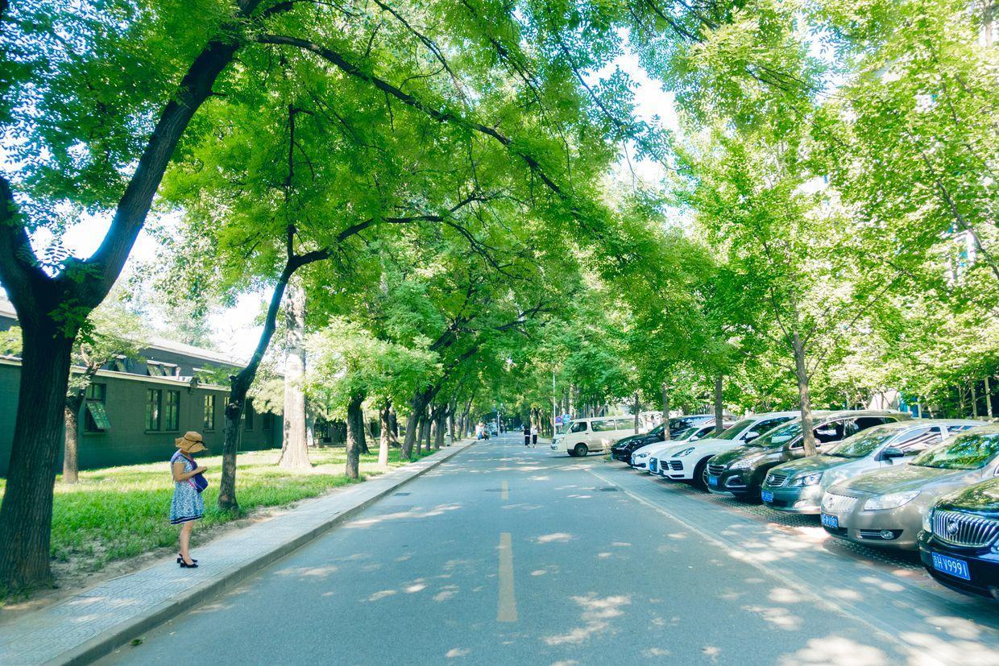

下了课，去超市买点东西。

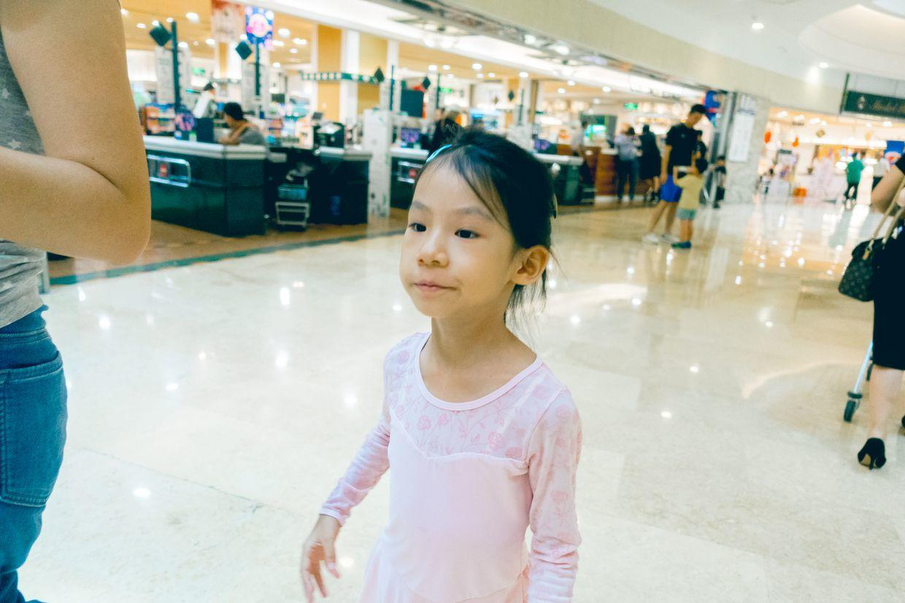

一起坐滚梯。

中午睡了一觉，下午老师来家访啦。

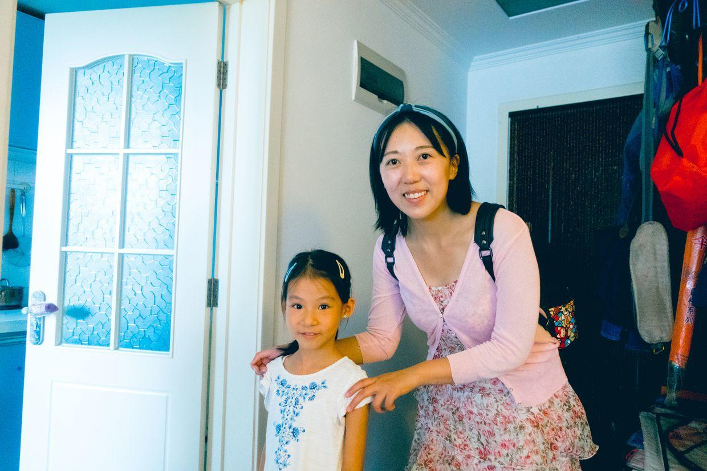

封面

认了字，听老师讲了上学的一些安排，还给老师背着谱子弹奏了《快乐女战士》和《天空之城》。

表现非常好，开始有一点点腼腆。

明天一早就要准备去小学开始试上课啦。

连续三天，每天早上去上半天课，真是让人兴奋又紧张啊。

把书包和相关材料都准备好，明天出发。

***最近喜欢的诗***
>唐伯虎的白日升天图里的题诗，描述了虫洞
只见白日升天去
不见青天落下来
有朝一日天破了
众人齐喊啊怪怪

**个人微信公众号，请搜索：摹喵居士（momiaojushi）**

          
        