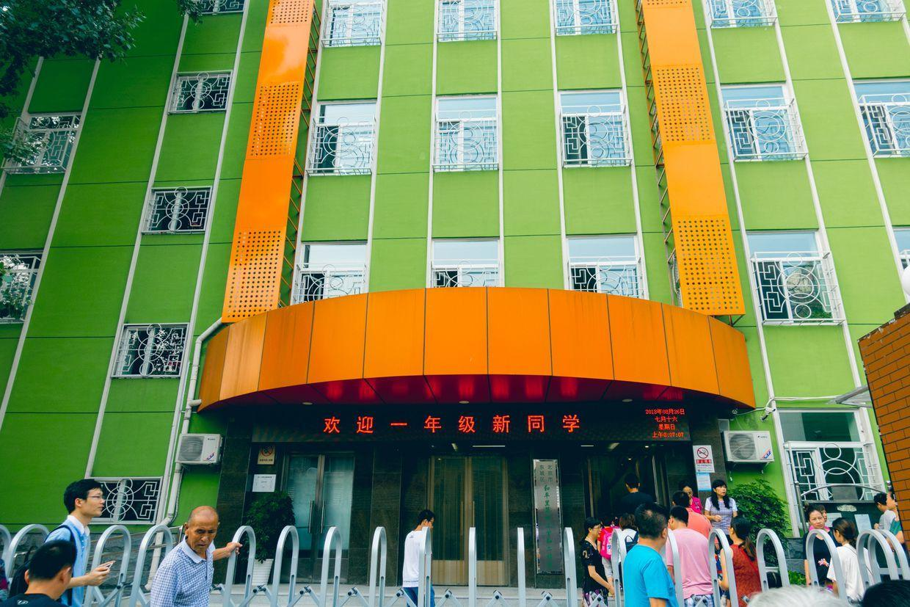

          
            
**2018.08.26**

周日啦，今天是小学第一天试上学的日子。

一早吃好早饭，出发去学校啦。

到得有点早，在早餐店又迟了个茶叶蛋，迎着晨光走向学校。

一路聊着天，一起走过去。

路上遇到了两只小猫。

学校门口已经排好大队。

欢迎一年级新同学。

耐心地等待。

操场上9班的同学排好队伍。

好奇地看着周围的一切。

老师们在等待同学。

家长们在操场另一端等候，一切安排得很有计划。

同学们准备进教室。

挥手致意。

封面

进教学楼前一回头。

中午放学啦，老师带着同学们来到家长等候区。

同学们跟着老师排队出来，路上非常拥挤。

看见我们啦。

和老师说完再见，一起回家啦。

一路上给我们讲了今天在新学校的见闻。

上了课，每个同学都做了自我介绍。

得到了2个小贴纸，还有体育课。

真是非常有收获的第一天啊。

***最近喜欢的诗***
>唐伯虎的白日升天图里的题诗，描述了虫洞
只见白日升天去
不见青天落下来
有朝一日天破了
众人齐喊啊怪怪

**个人微信公众号，请搜索：摹喵居士（momiaojushi）**

          
        