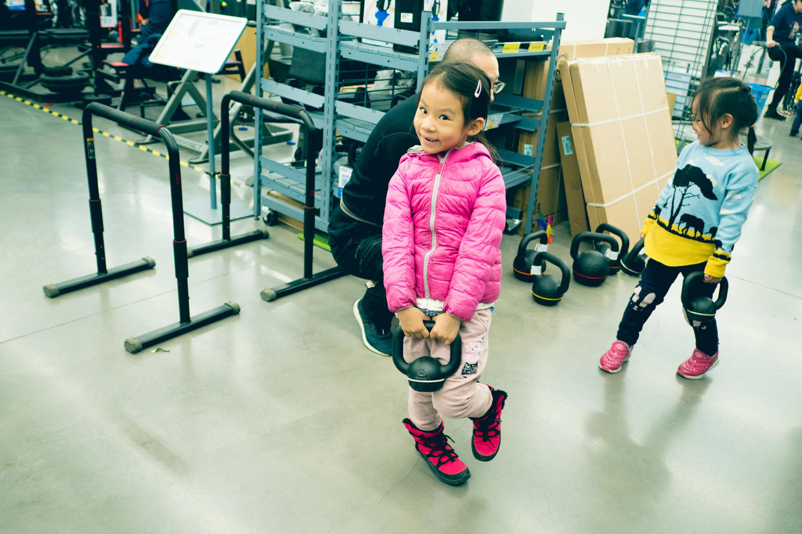

          
            
**2018.08.27**

**拍摄时间：2017.12.24**

**拍摄地点：迪卡侬**

这张照片时2017年底去迪卡侬的时候拍的。

四元桥家乐福是一个很好的去处，有个大大的超市，可以买一周要用的东西。

旁边就是宜家，顺便逛一下也很方便。

地库和屋顶的停车场，车位也还算充足。

商场里吃饭的地方很多很方便，还有个优衣库，买几件便宜衣服也很合算。

这一切都逛完了，还可以去迪卡侬里活动一下。

之前喵最喜欢蹦床，可是最近好像被撤掉了。

不过健身区里还是有很多可以玩儿的。

这个铃壶很有趣，大大的把手，比铃壶本身都要夸张。

旁边那位小姑娘手里拿了2个更小的铃壶。

说起来之前在迪卡侬买过一套组合哑铃，非常不好用，至今还躺在床底下。

东西确实很便宜，但是用起来也和这个价格差不多。

***最近喜欢的诗***
>唐伯虎的白日升天图里的题诗，描述了虫洞
只见白日升天去
不见青天落下来
有朝一日天破了
众人齐喊啊怪怪

**个人微信公众号，请搜索：摹喵居士（momiaojushi）**

          
        