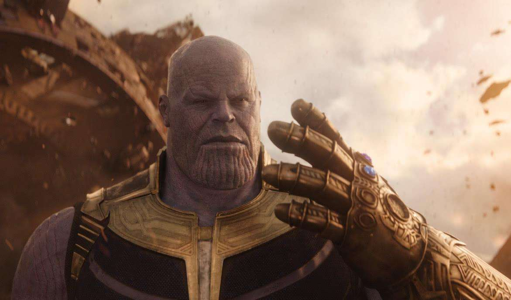

          
            
**2018.08.28**

最近和喵看了很多Marvel和DC的电影。

《正义联盟》、《蝙蝠侠大战超人》、《神奇女侠》、《复仇者联盟3无限战争》、《美国队长3内战》、《银河护卫队1》、《银河护卫队2》等等。

看了这些电影之后，扑面而来了许多问题。

无限宝石都是什么颜色？

灭霸为什么是紫色？

开飞船之前，为什么要把星云锁起来？

超人能打败灭霸吗？

美国队长为什么要打钢铁侠？

好多问题我也回答不上来，不过在问我的过程中，喵也会自己脑补这些问题。

她说：
>开飞船之前，把星云锁起来，是怕后面颠簸把她摔倒。

>超人用激光眼能打败灭霸

最令人惊讶的回答是，她觉得灭霸不应该把卡魔拉扔下去换取灵魂宝石。她觉得灭霸最爱的是自己，所以灭霸应该把自己扔下去才能得到灵魂宝石。

这个见解，突然让这个爆米花电影有了一些高度。

***最近喜欢的诗***
>唐伯虎的白日升天图里的题诗，描述了虫洞
只见白日升天去
不见青天落下来
有朝一日天破了
众人齐喊啊怪怪

**个人微信公众号，请搜索：摹喵居士（momiaojushi）**

          
        