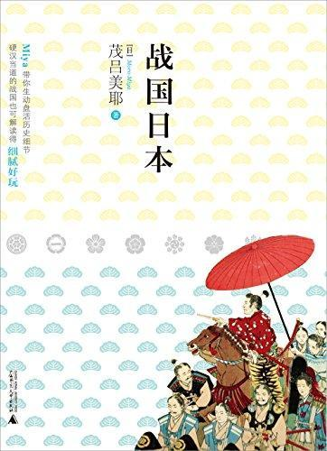

          
            
**2018.08.29**

非常有趣，按照时间顺序介绍著名的人。其中战国第一人新九郎的介绍，很有收获。作者还能作为两个孩子的母亲，去体会将军们对孩子们偏爱的心理。
<h2>2018.04.11（周三）</h2>
<h3>《战国日本》 - 01</h3>
>大事篇

各国守护大名干脆分裂为东军、西军，在京都燃起战火，名为“应仁之乱”，亦是战国时代开幕式

明朝成化年，日本战国开始
>1467年5月，东军二十四国十六万兵员，西军二十国十一万兵员，在人口只有二十二万的京都喊杀连天，害得后土御门天皇和后花园上皇紧急逃难至足利将军宅邸。

京都被毁
>室町幕府维持了二百四十余年，直至织田信长驱逐了十五代将军后，室町幕府才正式灭亡。

室町幕府
>守护大名必须住在将军所在的京都，实际在领地掌权的是守护代（代理之意），守护代底下则是地方豪门。这些守护代以及地方豪门在烽火连天、弱肉强食的时代中，逐渐演变为日后的战国大名。

看着大名，大名手下成了新豪强
>战国大名有两种类型，一种是由守护大名发展而成，另一种是典型的“下克上”大名；前者的代表是武田信玄，后者的代表是上杉谦信。

下克上出现
>八代将军足利义政不顾政治，而是热衷土木工程，现今京都银阁寺正是他别墅内的建筑之一。

大兴土木，银阁寺
>此时，“应仁之乱”的东、西军已交锋九年，京都四处断垣残壁，荒烟蔓草，民不聊生，一片凄凉。天皇为了赚取外快在皇宫大门外摆地摊，卖和歌、诗笺、绘画；公卿贵族也放下身段去当家庭教师或药剂行商；宫女则为了筹措宫廷内三餐米饭，不是变卖服饰便是客串流莺，情况比芥川龙之介的《罗生门》更惨不忍睹。

天皇做小买卖
>新九郎为何选中兴国寺城，大概只有同是英雄的道灌深知细底。关东与关西之间隔着一大片箱根山脉，形成天险。而从关东通往关西只有两条路线，一条是相模国（神奈川县）足柄山道，另一条正是箱根山道。当时的道路非常狭窄，行军时常成一列纵队，必须分成几队同时进军。

兴国寺城正是在这个高地上傲睨所有欲西行的军队。换句话说，兴国寺城是关东军队西行时必经之路的要塞。

新九郎扼手东西交通要道兴国寺
>以上下关系来看，是天皇—将军—管领—守护大名—守护代—地方乡豪—地方武士团—村民，而天皇和将军已失势，管领也就有名无实了，守护大名更是徒负虚名，实际掌管村民的是地方乡豪，对最底层的劳动阶级来说，守护代以上都是寄生虫。新九郎大概前半生看过众多浮名虚利的例子，因而年过半百拥有领地时，深知必须掌握民心才能巩固领主地位，他的作风在当时算是别创新格，许多后起之秀的战国大名均加仿效。

有民心，才有实力
>新九郎听使者带回的口传，马上派人传呼居于小田原西方金时山风间谷的“乱波”集团头目——风魔小太郎。

乱波，忍者也；关西方面称伊贺、甲贺集团为“忍者”，关东方面则惯称“乱波”。

风魔小太郎
>三浦军没仗可打，干脆在城外收割起农作物。新九郎见状，依然冷静地告诫大家：“不要冲动，不要气愤。要打，就要打胜仗。稻米可以重新播种，失去的性命却无法挽回。”

新九郎隐忍十五年，大败三浦
>“一向一揆”是本愿寺信徒发起的武装起义行为，而本愿寺是净土真宗流派之一。

当时的本愿寺已奄奄一息，随时都可能关门大吉，莲如登上宗主位子后，大胆进行改革，把教义简化为“只要口诵南无阿弥陀佛，任何人均可以往生极乐净土”。

1465年1月，延历寺派出一百五十名（也有三百名之说）僧兵袭击本愿寺，莲如好不容易才逃到近江金森。两个月后，延历寺再度攻击金森，致使莲如的信徒不得不拿起武器应战，这正是日本史上首次的“一向一揆”。

“一向宗”是其他佛教流派称呼本愿寺信徒的别称，并非莲如自创。

本愿寺的净土真宗得势
<h2>2018.04.12（周四）</h2>
<h3>《战国日本》 - 02</h3>
>虽然道三赤手空拳成为一国之主的形象破碎了，但他的人气指数依然不减，主要原因在于他的悲惨下场。战国时代的确是下克上、背恩忘义的时代，然而子诛父的例子却古今少有。为何道三会死于亲生儿子的毒手呢?

蝮蛇道山，死在儿子手里
>美浓国（岐阜县南部）位于日本群岛中心点，四周有六个国家，离京都不远，自古以来是交通要冲?

位置太好了
>翌年4?20日，三千名道三军与一万两千义龙军隔着长良川开战，理所当然寡不敌众，道三死在儿子手上，享寿六十三。开战前夕，道三留下遗书，说要将美浓国让给女婿织田信长。而信长虽然也带军前往美浓援助，却没赶上决战。信长正在布阵安营时即遭义龙军袭击，当下明白岳父已阵亡，只得亲自殿后边开枪边撤军?

美浓国的稻叶山城，信长后将之改名为岐阜城?

道三在战场目睹“糊涂虫”儿子的精彩指挥，这才恍悟自己看错了儿子的才干，可惜为时已晚?

道三儿子太厉害，信长都对付不了，可惜早逝
>义龙死后第六年，三十四岁的织田信长才平定美浓国接收了稻叶山城，并改名岐阜，也就是现代的岐阜县。“岐”是根据中国岐山而取，周文王在此奠立了八百年江山；“阜”则取自孔子出生地曲阜?

岐山和曲阜
>毛利元就长年臣属大内氏，受过大内氏众多惠顾，然而当时他只是支配半个安芸国的小领主，对陶晴贤的叛变之举敢怒不敢言。他表面佯装臣服陶晴贤，其实是专注养精蓄锐，扩张领土。三年后，毛利元就终于向内外宣告与陶晴贤断交，并在数天内攻下安芸国内的陶方诸城?

陶军勇将均主张走陆路，陶晴贤却一心想先拿下严岛，确保海路运输后，再沿岸收回被毛利占领的诸城?

世界遗产严岛神社，每年有将近三百万访客?

毛利元就，严岛之战，现在海上鸟居成了名胜
>有关毛利元就的逸闻，最有名的是“三矢之训”。据说元就以三支箭训诲三个儿子，说一支箭很容易折断，三支箭则很难折断，告诫儿子务必团结。其实此故事是后人虚构的，不过毛利元就确实亲笔在家书中写着：“倘若三人之间稍有隔阂，三人必均灭亡。?

兄弟阋于墙
>如果随便抓一名日本人问道：“你认为战国武将中，谁最强？”对方很可能会在武田信玄和上杉谦信这两人之间犹豫不决，但绝不会选择最终纳天下入掌的德川家康。毕竟德川家康曾数度惨败如山崩?

武田家
>武田信玄是甲斐国（山梨县）守护武田信虎的嫡子，生?1521年，时代刚好处于长约一百三十年的战国期间正中。最初令武田信玄播名天下的是放逐父亲事件?

翌年，信玄受幕府将军之托，率兵上洛，途中攻打德川家康，即三方原之战。这场仗把德川家康打得屁滚尿流，而闻名后世的甲州铁壁军团也正是在这场仗中凝结成形。无奈造化弄人，再强的武田信玄也敌不过老天爷的一句话，就在他打算攻打织田信长时，宿疾肺结核（另一说是食道癌）恶化，在撤军北上回信浓途中撒手尘寰，享年五十三?

马上灭信长，结果去世
>武田信玄的“风林火山”军旗，典故出自中国《孙子兵法·军争篇》：“其疾如风，其徐如林，侵掠如火，不动如山。”信玄在过世四个月前才组成甲州铁壁军团，但继任者胜赖自尽后，失去主子的这些军团到底何去何从呢？正是曾遭这支军团痛击的德川家康收容了他们。基于感激，他们日后在关原合战中也拼命立功?

风林火山归了德川家康
>真正的信玄是个白皙温文的诗人武将?

惜落花
檐外红残三四峰，

蜂狂蝶醉景犹浓?

游人亦借渔翁手?

网住飞花至晚钟?

信玄的诗，很不错
>1572年，武田信玄受将军之托率大军上洛，在远江三方原击败织田、德川联合军，但信玄于翌年病逝，武田军不得不自三河国撤军，织田信长重整体势后随即放逐了将军义昭，室町幕府就此灭亡?

信长灭亡室町幕府
<h2>2018.04.13（周五）</h2>
<h3>《战国日本》 - 03</h3>
>5月29日，信长前往京都，打算支援正在跟毛利对打的丰臣秀吉，住宿京都本能寺。

“人间五十年，与下天比之，直如梦与幻；有幸来人世，何能永不灭？”

信长到了人生终点
>本能寺事变的最大受惠者是丰臣秀吉。丰臣秀吉始终是明智光秀的竞争对手，无奈事事都比光秀略逊一筹。本能寺事变后，信长众臣均陷于无能、混乱状态，只有丰臣秀吉保持冷静，面不改色自战场马不停蹄地赶回京都为主君报仇。

事后又巧妙地立信忠嫡子为继任者，掌握了织田政权。

秀吉利用了这个机会
>丰臣军于7日早上离开沼城，当天夜晚抵达播磨（兵库县）姬路城。高松城至姬路城约七十公里，即便没在沼城休息而不眠不休地赶路，三万大军也不可能在一天半就抵达姬路，这也是“中国大返还”的最大奇迹兼最大疑问。

高松城至姬路城约七十公里，姬路城至山崎约一百一十公里，全程一百八十公里……虽然后人无法证明丰臣秀吉到底如何完成此举，但他确实办到了。也因为办到了，才能抢到天下大饼并成立丰臣政权。

秀吉如何这么快返回，还是个迷
>德川家康不如织田信长那般积极主动，也欠缺织田的改革魄力，脑筋更比不上丰臣秀吉灵活，但他具有耐性与组织经营能力，这是其他两人不可及之处。

家康在六岁至八岁期间是织田家人质，八岁至十九岁期间是今川家人质。

从小做人质，很有耐性
>想当年武田信玄率三万大兵上洛途经滨松城时，本来打算不理德川家康，放他一马，但家康念在与织田信长之间的情义，硬是率八千兵力阻挡，结果被打得一败涂地（三方原之战）。

山崩一样的失败
>9月15日决战当天，西军石田派主帅是毛利辉元，兵力八万二千；东军德川派主帅是德川家康，兵力八万九千。按阵形来说，展开鹤翼之阵围住东军的西军，理应战胜才对，但德川家康事前已做好各种谋略，因此只花半天便定胜负，而关键球正是西军小早川队。

关原合战，小早川秀秋倒戈
>合战后第三天，朝廷即请他出任武家最高阶位的“征夷大将军”，只是此阶位毕竟只限武家，无法与公卿贵族平起平坐。于是家康也步秀吉后尘，勤奋地向朝廷进行幕后活动，等了一年半，终于得到从一位官阶。之后又等了一年，获得“源氏长者”（相当于日本国王）宣旨，名副其实地登上武家、公卿贵族最高位之后才创立江户幕府。

家康文武官职都第一之后，做征夷大将军
>家康便告诫道：“从来不向上司请安的人群中，反倒埋有人才。”意思是真正的人才往往不会在上司眼前晃来晃去。之后家康又说：“所有珍宝中，人才最贵重。”这句话成为家康名言之一。

“真正的人才往往不会在上司眼前晃来晃去”，这句话似乎正是德川家康的最佳写照。

人才最重要
>饮食篇

“织田先捣舂，羽柴（秀吉）揉捏天下糕，躺着吃的是德川。”这是一首庶民讽刺家康坐享其成的打油诗，却讽刺得正中红心。

家康六十六岁还让侧室生下第十六个孩子市姬（四岁时夭折），七十四岁又亲自上战场指挥攻下大阪城，翌年才过世。老当益壮得令人羡慕。只是这位“狸爷”为何能如此健康又长寿呢？

根据《名将言行录》记载，家康生前很爱吃麦饭，这是不是表示他从来没有便秘过？而小麦的钙质又比白米多出七倍，难怪在江户时代后叶成书的《甲子夜话》中，用三首和歌来比喻他们：“不啼叫的话……春晓杜鹃鸟。”

家康长寿秘诀是吃麦饭
<h2>2018.04.14（周六）</h2>
<h3>《战国日本》 - 04</h3>
>中间那句，若是由织田信长来填，必定是“快快拿下斩杀掉”；丰臣秀吉则是“我来让它展歌喉”；德川家康便是“耐守时候等它鸣”。

三个人不同性格
>藤堂高虎突然闻到一阵麻糬香味，禁不住一把抓起拼命往嘴里塞，回过神时已吃下好几个。所幸老板与左卫门是好人，不但不索钱还给了路费，向他说：“你不要往东，回故乡近江好好孝顺父母。”

三十多年过后，高虎成为一国藩主，某次带着随从途经吉田宿驿，特地到那家麻糬铺亲切地问主人：

“老板，久违了，还记得我吗？”

这故事看似后人编造，不过津藩首席家老（家臣总管）中川藏人在日记中记载该藩有个惯例，麻糬一定得吃跟藩祖有关的三河吉田宿驿与左卫门铺子的，可见并非后人添枝加叶。

藤堂高虎这个麻薯故事好像韩信和漂母
<h2>2018.04.15（周日）</h2>
<h3>《战国日本》 - 05</h3>
>上杉谦信在战国武将中是位特殊人物，他从未基于扩张领土或自己的野心而跟别人打仗，总是站在正义这一方。

太少见了
>我这个年龄的现代日本人，在自家做饭团时，也会准备一碗盐水将掌心濡湿，再把米饭握成三角形、圆形或其他形状；一来可以避免手掌烫伤，二来饭团表面有咸味，如此即便饭团内没有梅子或其他配菜，只要裹上紫菜就很好吃。

手上沾着盐水去握饭团，是丰臣秀吉发明的
>朝鲜半岛非常冷，以加藤清正为首，所有自日本过去的武将都受不了，便把辣椒塞在布袜或内衣取暖。

辣椒塞进内衣
<h2>2018.04.16（周一）</h2>
<h3>《战国日本》 - 06</h3>
>神崎川附近有个名为“佃”的渔村，村长得知家康一行人的困境后，不但提供渔船，也献出村人平时为鱼荒而储存的咸煮小鱼。正是这些盐水煮成再晒干的小鱼成为家康一行人翻山越岭时的军粮。日后，家康召集了伊贺忍者，让他们成为江户城守卫军团，首领服部半藏也成为家康的腹心之臣。现今日本皇居的半藏门、半藏濠、地铁路线半藏线均取自服部半藏的名字。

家康逃回关东靠了忍者
>至于佃村三十余名村民也在1590年跟随家康移住江户，成为德川家御用鲜鱼商。

帮忙的渔民成了家康的御用鱼商
>战国时代最长寿的武将是南光坊天海僧正。

据说这位怪僧正是德川家康定天下的关原合战参谋之一，也是家康近侍。

家康七十五岁步上黄泉之路时，天海八十一岁，之后这位怪僧又辅助了二代将军秀忠、三代将军家光，以阴阳道及风水论为主，参与江户都市建构计划，奠定了长达二百六十余年的德川幕府江户时代根基。

竟然活了108
>女性篇

阿安的母亲与众武士妻子均在天守阁铸造枪炮子弹，而所有被斩下的敌方头颅也都送到天守阁，让女人们一个个绑上名牌。当时身份地位高的人习惯把牙齿染黑，女人受武士之托（敌方头颅身份地位愈高，战功便愈高），还必须负责为头颅染牙。她们于白天为头颅化妆并铸造子弹，夜晚就与这些头颅睡在一起。

这个工作真吓人，给头颅染牙
<h2>2018.04.17（周二）</h2>
<h3>《战国日本》 - 07</h3>
>浅井家灭亡后，父亲在藤堂高虎家当浪人宾客，俸禄落到三百石。简单说来，阿菊的祖父和藤堂高虎同为浅井家家臣时，祖父是一千二百石身份，高虎的地位则很低，经常三餐不继，阿菊的祖母看不过去，时常叫高虎来家中吃茶泡饭。高虎不忘当年的一饭之恩，因而收留了家道中落的阿菊父亲。

宽厚待人会有回报
>我想，有关战争，男人的话最好少听为妙，要不然至少也要给他减个九十分再放进笊篱筛一下。女人说的则可以百分之百尽信。因为自古至今，女人始终是战争旁观者、牺牲者，也是战争善后者。

女性记录历史比较客观
>千年前的平安时代是走婚制度，维系男女关系的要素是爱情，一旦有一方移情别恋，随时可以一刀两断，走得干干脆脆，因此这时代的家产全由女子继承。之后的镰仓时代已是武士阶级封建社会，但女人的地位仍相当高，不但有女地头（能乐、游艺等掌门人），女人也可以继承家门当上一家之主。

平安和镰仓时代妇女地位还不错
>然而室町时代至战国时代，女人的地位逐渐降低，就算起初分得家产，日后也会遭没收回归长男手中。简单说来，就是女子嫁出去时，即便父母给予家产当做嫁妆，除非有正式转让书，否则死后财产还是回归到娘家的大哥或大侄子手中。

室町时，妇女成了财产
>阿市是织田信长的二妹，小信长七岁，战国第一美女。

战国第一美女，第一任丈夫战死，和第二任丈夫一同赴死
>茶茶在二十岁那年成为秀吉侧室，该年生下男子鹤松，但鹤松体弱多病，不满三岁即病逝。二十四岁又生下秀赖，成为天下大饼继承人的母亲。二十九岁时，秀吉过世，此时秀赖只是个六岁童子。翌年元月，茶茶拥秀赖进入大阪城，登上大阪城女帝之位。

茶茶三十一岁时，关原合战爆发，石田三成率领的丰臣军战败。茶茶三十四岁时，德川家康就任征夷大将军，创立德川幕府；同年7月，秀赖与家康孙女千姬成婚，这是家康对丰臣家的怀柔政策之一。之后，家康陆续夺走丰臣领地，

茶茶四十二岁那年，德川家康与丰臣秀赖在二条城晤面。据说，家康看到孙女婿在大阪城内娇生惯养得如同一头肥胖白猪，缺乏一国君主器量，才决心攻打大阪城。茶茶四十六岁那年，大阪城陷落，茶茶只得与秀赖在城内纵火自尽，末路跟母亲市姬一样。以上是长女茶茶的坎坷一生。

一生坎坷
>此时的秀吉已跨人老境，成天担忧独生子秀赖的将来，他看准家康在自己死后会成为秀赖的最大敌人，因此收阿江为养女，把阿江硬推给家康的三男秀忠当媳妇。秀忠当时才十七岁，阿江则是已生过孩子的二十三岁寡妇。岂知这门政略婚事竟成为阿江的锦绣人生之扉。

>当亲生长男家光升任三代将军时，阿江成为将军的生母，也就是“国家的母亲”。哇，天下还有什么地位比“国家的母亲”更高的？恐怕连中国皇帝也要听母亲的话吧。附带一提，德川幕府历代将军中，只有三代将军家光是正房生的孩子。

茶茶的三妹，反而成了将军的国家的母亲
>濑名姬带着两个孩子来到丈夫的故乡冈崎，却因婆婆（家康的生母）命令，无法住进城内，家康只得在城外北部筑山另外兴建宅邸让母子三人居住，从此德川众家臣便称她为“筑山殿”。

在筑山居住，得名筑山殿
<h2>2018.04.18（周三）</h2>
<h3>《战国日本》 - 08</h3>
>二十三岁的秀赖和茶茶母子于次日上午在大阪城内自尽，丰臣家就此灭亡。秀赖的儿子国松丸则遭斩首，千姬为了救秀赖女儿一命，收她为养女，那女儿日后成为镰仓东庆寺（正是著名的“缘切寺”，请参照拙著《江户日本》中的《大江户恋爱》）

丰臣秀赖的女儿幸存
>第二十代住持。

阿福对家光付出了比亲生母亲阿江更慈、更严、更深的感情。不料在家光三岁时，阿江又生下幺儿国松。这两兄弟虽是同母同父，长相却判若云泥。家光外貌比较像祖父家康，肤色黝黑、额头突出，再怎么加分也不可能列为美男子末席，加上生来体弱多病，反应迟钝，又有口吃毛病。而国松似乎传袭了织田家俊男美女的血统，肤色白皙、眉清目秀，而且禀性聪明伶俐，人见人爱。

家光和弟弟比起来，不怎么样
>家康看到家光和国松并排坐在一起，命侍女把家光的坐席换到上座，再若无其事对众人说：“家光是未来的天下之主，即便是亲兄弟，国松也只是臣下，怎能让兄弟俩同席而坐？”就这么一个举动，决定了家光与国松的命运。

奶妈阿福去找家康确立家光地位
>城池篇

所谓“天守阁”，是城池中心规模最大的“橹”，也就是箭楼、望楼。战时是城主的司令塔、最终死守处，平时则是领主的权势象征。

出现在文献中的第一座天守阁是兵库县伊丹城（1550年，目前只剩遗迹），然而现代普遍可见的五层或七层天守阁建筑样式鼻祖，则是织田信长的安土城（1576年，滋贺县，目前只剩遗迹）。

天守阁
>此外，人称“日本三大名城”的熊本城、名古屋城、大阪城，前二者是复原的，大阪城则为重建（日文为“复兴”）。附带一提，京都二条城虽然没有天守阁，但也是国宝之一。至于江户城，也就是现在的皇居千代田城，既是国家重要文化财，更是全球总面积最广的城池，但由于城主是现任第一百二十五代今上天皇，自应另当别论，在此就略过不提。

三大名称，都不是原装
>“野面积”是堆砌天然石而成，缝隙间再塞入小石块补强，以巩固城墙。优点是利于排水，缺点是敌人很容易爬上来。

“打込接”是先将石块加工成平面再予以堆砌，缝隙间再塞入小石块。关原合战以降，多半采取这种工法，城墙得以更为陡峭、更具霸气。

“切込接”则是将石块加工成长方形再堆砌，石块间几乎毫无缝隙，类似砖墙，江户时代以后常见，京都二条城便属这类。

三种筑城方法，越来越细致
<h2>2018.04.19（周四）</h2>
<h3>《战国日本》 - 09</h3>
>前田家在明治时代是华族中仅次于公爵的侯爵地位，目前也是日本名门中之望族，不但献出江户时代宅邸成为今日的东京大学，战后又将驹场宅邸改建为近代文学馆，连位于镰仓的别墅宅邸也捐赠给镰仓市。前田家不愧是名门中之望族，无论战前战后，始终是日本的文化贡献者。

大名们在明治维新后都成了华族
>最后值得一提的是名古屋城二丸庭园西北方有座“埋御门迹”石碑，位于二丸茶亭附近。这是让藩主在敌方攻进城内时可以紧急避难而设计的安全门。

守护这扇安全门的护卫被称为“御土居下同心”，总计有十八家，是世袭忍者集团，代代刻苦学习家传剑术、马术、柔术、弓术、泳术、炮术、兵法、儒学、汉诗、书法、吹笛、茶道等，文武两全，本领大概比现代的特种部队更高。

他们的存在只限藩主与少数重臣知道，而且基于保密，代代过着与世隔绝的日子。无奈和平时代长达二百多年，连后代藩主也忘了他们的存在。明治维新后，这些忍者集团奉还“忍轿子”时，末代藩主还莫名其妙地问道：“这是什么玩意儿？”

明治维新后，十八家忍者各自离散，代代相传的忍者技艺大概也就此失传，实在很可惜。

忍者家族失传

***最近喜欢的诗***
>唐伯虎的白日升天图里的题诗，描述了虫洞
只见白日升天去
不见青天落下来
有朝一日天破了
众人齐喊啊怪怪

**个人微信公众号，请搜索：摹喵居士（momiaojushi）**

          
        