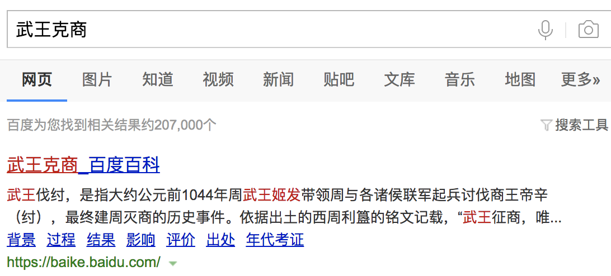

          
            
**2018.08.30**

>武王伐纣，是指大约公元前1044年周武王姬发带领周与各诸侯联军起兵讨伐商王帝辛（纣），最终建周灭商的历史事件。
依据出土的西周利簋的铭文记载，“武王征商，唯甲子朝，岁鼎，克昏夙有商。”武王伐纣，一夜之间就将商灭亡，在岁星当空的甲子日早晨，占领了朝歌。西周利簋的铭文，澄清了武王伐纣具体日期，证实了古籍中所载的“战一日而破纣之国”的正确记载。

说起武王克商，《淮南子》里提到岁星，也就是彗星，慧尾朝向东方，预示了商的灭亡。
>“武王伐纣，东面而迎岁，至汜而水，至共头而坠。彗星出，而授[殷人]其柄。时有彗星，柄在东方，可以扫西人也！”

不过据天文学家判断，哈雷彗星当时应该没有出现。

不过《淮南子》作为一步杂书，可能有些牵强不准确。

据说，当年的哈雷彗星不像现在损耗那么大，那时还是很辉煌的，横跨整个天际。

许多保留古老历史记载的民族传说中，这都不是吉利的象征。

***最近喜欢的诗***
>唐伯虎的白日升天图里的题诗，描述了虫洞
只见白日升天去
不见青天落下来
有朝一日天破了
众人齐喊啊怪怪

**个人微信公众号，请搜索：摹喵居士（momiaojushi）**

          
        