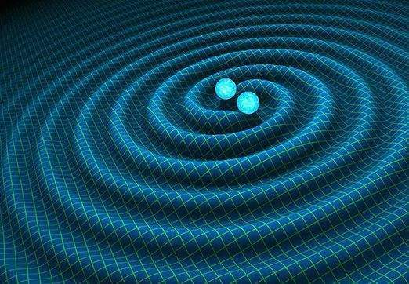

          
            
**2018.09.04**

前段时间，在夏天最热的时候，中午是完全不可能出去玩儿的。

通常周日上午练练琴，然后去商场买点东西，吃个午饭，就回家休息了。

到家之后，把照片整理好，然后打开冰箱，拿上一根冰棍，回屋开开空调，躺在凉席上。

打开手机，播放上北师大赵峥教授的《从爱因斯坦到霍金的宇宙》，一边听着，一边吃冰棍。

这时，喵也会拿着自己的冰棍，跑过来，爬上凉席，趴在这头上，一边吃冰棍，一边和我一起听。

听到有意思的地方，也会哈哈笑。

那天，我们听到了爱因斯坦的引力波论文。

这个讲座播的时候，还没有发现引力波，所以在已经知道有引力波的时候，回过头来听这个节目很有趣。

1915年 爱因斯坦提出广义相对论。1916年，爱因斯坦发表论文，认为当物质分布改变时，时空也会相应变化，这一变化会以波动的形式以光速传播。这就是引力波的由来。自2015年首次直接探测引力波，人类已寻找了它100年。

2015年9月14日 LIGO完成了人类历史上第一次引力波探测。一个36太阳质量的黑洞与一个29太阳质量的黑洞的碰撞，然后并合为一个62太阳质量的黑洞，失去的3太阳质量转化为引力波的能量。

引力波信号来自距地球约1.3亿光年的长蛇座内NGC4993星系。

最后，我跟喵说，爱因斯坦100年前提出有引力波，100年以后，2015年咱们地球探测到了引力波。

而第一次探测到的引力波，是来自1.3亿年前。

喵嘴里叼着冰棍，惊讶地张开了嘴，虽然她还不知到“亿”有多少，但是她知道100的含义。

***最近喜欢的诗***
>王安石三十岁，在浙江鄞县知县任满回江西临川故里时，途经杭州，写下此诗。
登飞来峰
飞来山上千寻塔，闻说鸡鸣见日升。
不畏浮云遮望眼，自缘身在最高层。

**个人微信公众号，请搜索：摹喵居士（momiaojushi）**

          
        