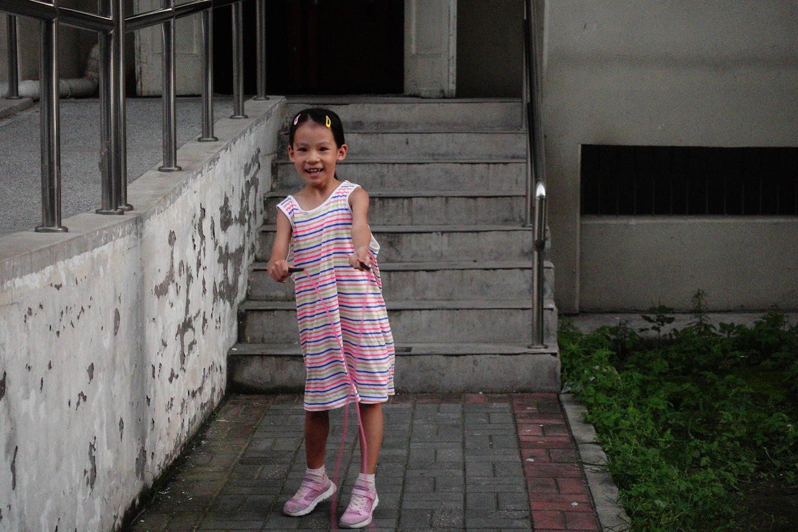
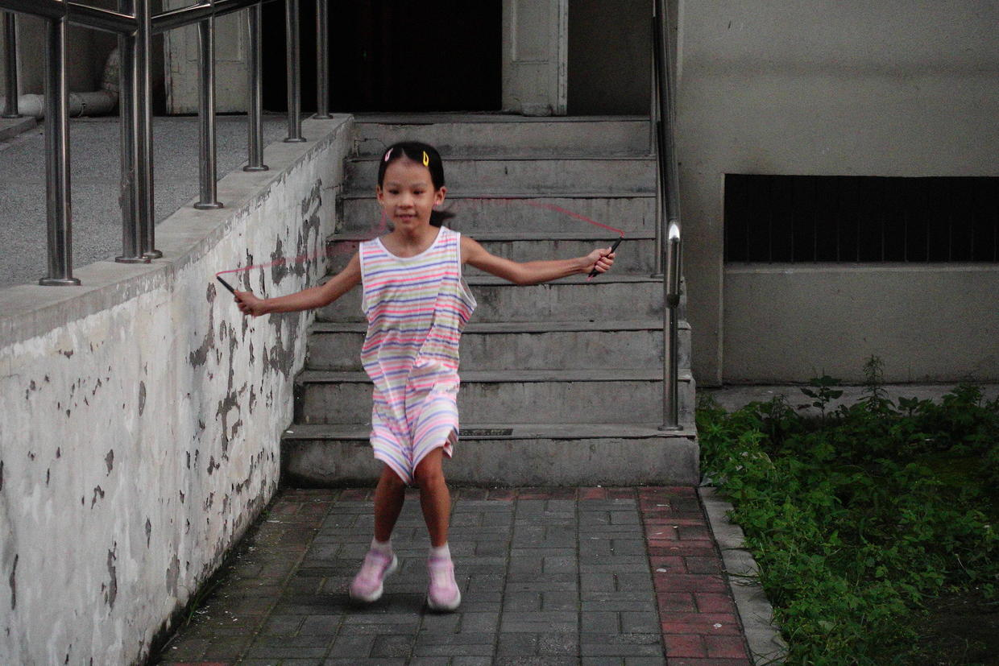
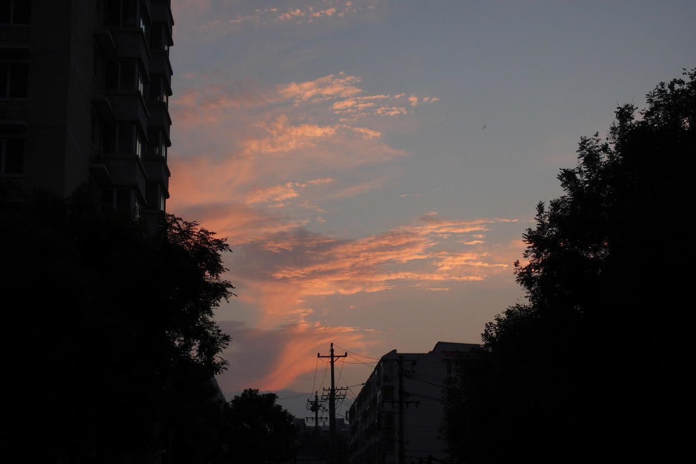

          
            
**2018.09.11**

开学前的时间里，开始每天坚持跳绳训练，主要的目的就是要锻炼一下身体，提高肺活量和协调性。

和单调的跑步不同，喵对跳绳还是有些兴趣。

在这段时间的训练下，终于可以轻松地连续完成20个不坏。

快跳完的时候，天色已经晚了，难得出现了美丽的晚霞。

每次连续跳20下，连续跳3轮，然后我们一起双人跳。

双人跳从最早的3个，到现在已经能调23个，发挥好的时候，甚至超过30个。

跳完了绳，一起提着小灯去练爬楼梯，一共有16层。

喵有点怕黑，但是楼道里都有灯，可能还是觉得人少，有点恐怖。

我们俩一路晚上爬，到了8层，我说休息一下吧。

喵说：
>我有点害怕，我们还是赶紧爬完吧。

接下来一口气到16层然后最电梯下楼，连我都觉得有点累。

害怕还有这么大的动力啊。

第二天早上出门，我问她腿酸不酸，她点点头，然后飞也似的跑出去了。

看来腿还不够酸。

***最近喜欢的诗***
>长大后，最新会背的一首诗
过零丁洋
辛苦遭逢起一经，干戈寥落四周星。
山河破碎风飘絮，身世浮沉雨打萍。
惶恐滩头说惶恐，零丁洋里叹零丁。
人生自古谁无死？留取丹心照汗青。

**个人微信公众号，请搜索：摹喵居士（momiaojushi）**

          
        