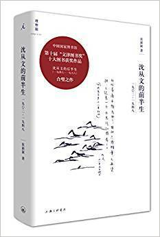

          
            
**2018.09.12**

非常浪漫的前半生，尤其是和妻子爱和交流，可惜一切从建国后戛然而止。
<h2>2018.04.24（周二）</h2>
<h3>《沈从文的前半生》 - 01</h3>
>沈从文的前半生：1902—1948

一九〇二年十二月二十八日，农历十一月二十九，湘西小城镇筸，诞生了一个男孩，名叫沈岳焕。

沈从文，沈岳焕
>镇筸gan1，是凤凰的旧称。

凤凰古镇
>沈从文兄弟姐妹九人，他排行第四，男孩中排第二。二姐十七岁时生病死去，两个弟弟和一个妹妹幼年夭折；从成年后来说，沈从文上面有大姐沈岳鑫、大哥沈岳霖（别字云麓），下面有六弟沈岳荃（字得余，后常用名沈荃）、九妹沈岳萌。

一堆兄弟姐妹，排老四
>上去。”—河中的鳜鱼被钓起，天上飞满风筝，空山中歌呼的黄鹂，树木上累累的果实—神游于外，处罚的痛苦也就忘掉了；而且，“我应感谢那种处罚，使我无法同自然接近时，给我一个练习想象的机会。”（13；254）

从小观察自然
>家中不了解我为什么不想上进，不好好的利用自己聪明用功，我不了解家中为什么只要我读书，不让我玩。

真是互相不理解
>第二年，民国建立，凤凰再次起义成功，沈宗嗣成为当地要人；但在此后举行的省议会代表选举中，败给一个姓吴的竞选者，一气之下，远走北京。他离开凤凰时，沈从文最小的妹妹沈岳萌，出世三个月。三年后，沈宗嗣因组织铁血团谋刺袁世凯事泄，逃亡关外，隐姓埋名。等到袁世凯称帝失败，家中才得到他的音讯，比沈从文大四岁的哥哥沈云麓十八岁，远赴热河寻父；一九一九年，二十一岁的沈云麓终于从赤峰把父亲接回湘西。

父亲真是大胆，哥哥真是厉害
>商会会长年轻的女儿得病死去埋葬后，当夜便被本街一个卖豆腐的年轻男子从坟墓中挖出，背到山洞中睡了三天，又送回坟墓里去。这事为人发觉，卖豆腐的男子押解到清乡司令部，随即就地正法。

恐怖啊
>这一笔数目巨大的吃亏吓着了他，他想不出怎么办，想不出比逃走更好的办法。八月底，他偷偷离开母亲和姊妹，想走得越远越好。

坑母亲和姐妹啊
>有时去学校，两个恋人坐在大风琴边，沈从文照例站到后门边观风。校长蒋老太太一到学校，沈从文做个暗号，里面琴声忽然响起。

这位女校长蒋慕唐，有个女儿叫蒋冰之，几年之后将以“丁玲”的名字登上文坛。

和丁玲的缘分
>说粗野的故事，喝寒冷的北风，让船儿慢慢拉去，到应吃饭时，便用极厉害的辣椒在火中烧焦蘸盐下饭。

真有画面感
>他准备到北京读书。

当沈从文向陈渠珍陈说自己的打算时，陈渠珍应允并且鼓励，还让他领了三个月的薪水，二十七块钱。

陈长官真是个好人
>在北京大学担任统计学讲师的郁达夫，也收到了沈从文的信，十一月中旬的一天，他来到“窄而霉小斋”，看望这个素不相识的“可怜的人”。他摘下自己的围巾，留给没有过冬衣服的沈从文；又请他吃午饭，拿出五块钱结账，剩下三块两毛几分，也留给了他。

第一次了解郁达夫的言行
<h2>2018.04.25（周三）</h2>
<h3>《沈从文的前半生》 - 02</h3>
>不到一点钟，就把一小卷似乎用日本纸写的长信递给我来欣赏，且一面说这信是封刚从美国寄来的，你读读看，内中写得多真诚坦率又多有情！原来是他的好友林徽因女士来的一个长信。他就为我补充这个朋友的明朗热情种种稀有的性格，并告我和写信人的友谊种种。那时他还未曾和陆小曼结婚。对人无机心到使人吃惊程度……

沈从文和徐志摩一见如故，还看林徽因的长信
>这里面有以稿酬缓解生活压力的因素，这是一个现实的解释；大量写作更内在的原因，是强烈的尝试冲动和把这种冲动快速付诸笔端的实践：这些包括散文、小说、诗歌、戏剧等多种文学样式的作品，初露才华，但无疑都是急切的尝试之作—他并不明确地知道应该怎么写，应该写什么，所以他要不停地摸索、练习、实验

为了生活写作，更是为了尝试新的文学样式
>周作人的文章，“像谈话似的，从朴质中得到一种春风春雨样的可亲处来”；“鲁迅先生似乎就不同了。把他四十年所看到社会的许多印象联合在一起，觉得人类—现在的中国，社会上所有的，只是顽固与欺诈与丑恶，心里虽并不根本憎恶人生，但所见到的，足以增加他对世切齿的愤怒却太多了，所以近来杂感文字写下去，对那类觉得是伪虚的地方抨击，不惜以全力去应付。文字的论断周密，老，辣，置人于无所脱身的地步，近于泼剌的骂人，从文字的有力处外，我们还可以感觉着他的天真。”

评价周作人和鲁迅
>沈从文自道，“还是第一次看见梁先生。平时读他的文章，总觉得他是个才气纵横，不拘小节的大人物，听到这次致祝词，却感到一点酸秀才味，为什么这样迂腐？”

认为梁启超迂腐
>他特意请在湘西当兵的表弟印远桂代为收集家乡镇筸一带的山歌，这位小表弟带动周围一群二十来岁的兵士，抄录了约四百首之多寄给他，他从中整理出《筸人谣曲》，

如，“大姐走路笑笑底，/一对奶子翘翘底，/我想用手摩一摩，/心里只是跳跳底。”（15；21）

真是原生态
>一九二九年秋季学期，沈从文还在上海暨南大学兼了中国小说史的课，这对他是一个新的领域，他也认认真真去编讲义。

开始教书
>选沈从文课的，有一个女生张兆和，下了第一堂课，回宿舍，“谈到这位老师上课堂讲不出话来挺有趣。听说沈从文是大兵出身，我们也拜读过他几篇小说，是胡适之校长找来的人一定不错，可我们并不觉得他是可尊敬的老师，不过是会写写白话文小说的青年人而已。”[1]

这话是张兆和二姐张允和说的，当时她们姐妹俩对沈从文的了解和印象大约如此。

张兆和对沈从文第一印象
>张兆和写日记，耐人寻味的是，从七月初开始，日记中抄录了相关的全部信件，包括王华莲给她的一封、沈从文致王华莲一封、沈从文给她的三封、胡适致沈从文一封；这些信能够保存下来，也正是依赖她的日记。

张兆和日记里抄信
>第三篇，《论郭沫若》。即使仰仗“后视之明”，我们仍然无法确凿地判断，这篇尖锐的文学批评，与十八年后时代转折之际郭沫若对沈从文严厉的政治批判，之间是否有隐秘的关联

批评郭沫若，结果后来
<h2>2018.04.26（周四）</h2>
<h3>《沈从文的前半生》 - 03</h3>
>《从文自传》开篇说，“拿起我这枝笔来，想写点我在这地面上二十年所过的日子，所见的人物，所听的声音，所嗅的气味”，这些“日子”、“人物”、“声音”、“气味”，综合而成“我真真实实所受的人生教育”（13；243），而所有的一切，都发生在湘西及其周围边地，也就是说，这本自传的地理中心是湘西。

湘西风情画
>卖稿子的钱，又由巴金代为选购了一大包英译精装本的俄国小说，带着这样的礼物，沈从文八月初到了苏州。

张允和清晰地记得，这个夏季的一天上午，十点钟左右，九如巷三号石库门框黑漆大门外，来了一位身穿灰色长衫的青年人，戴一副近视眼镜。他说要找张兆和。

买了书，去苏州见张兆和
>张兆和吃了一惊：“旅馆？我不去！”

二姐说：“老师远道来看学生，学生不去回访，这不对。”

张兆和不得不同意。她问二姐：“怎样开口呢？”

二姐教她：“你可以说，我家有好多个小弟弟，很好玩，请到我家去。”

请沈从文来家里，还是二姐会待人接物
>去之前，沈从文先写一封信，张兆和把信给二姐看，因为，“信中婉转地说，要请我为他向爸爸妈妈提亲。并且说，如果爸爸妈妈同意，求三妹早日打电报通知他，让他‘乡下人喝杯甜酒吧’。我向爸爸妈妈说了，一说即成。”张允和给沈从文拍发电报，只用了一个字“允”，既表示婚事“允”了，也署了自己的名字。她得意地告诉三妹，不料张兆和却有些不放心，万一沈从文看不明白呢？她一个人悄悄坐人力车到电报局，递上自己的电报稿，“乡下人喝杯甜酒吧兆”。电文用白话，居然有一个“吧”字，“这在当时真是别开生面。”

白话文电报
>一九三三年初，沈从文同张兆和去看住在上海的张兆和父亲和继母，随即两人订婚；二月，张兆和随沈从文一起到青岛，在山东大学图书馆做外文书刊编目。

兆和人极好，待人接物使朋友得良好印象，又能读书，又知俭朴，故我觉得非常幸福。

张充和的记忆里“没有主婚人、证婚人”，其实是由张兆和三叔张禹龄证婚，由胡适主婚。周作人写了副喜联：“倾取真奇境，会同爱丽思。”

婚后生活很幸福
>一九三四年一月七日，沈从文启程回凤凰。这是他离开湘西十年后第一次返乡，历时一个月，多用于行途：坐火车到长沙，换汽车到常德，再坐汽车到桃源，从桃源雇一只小船沿沅水上行，至浦市后改走陆路到家；在家只停留了四天，即回北平。

会像看望母亲
>回北平后，沈从文即刻接续上《边城》的写作。动笔时正在新婚后的幸福期，

续写时母亲死去，“心中充满悲伤。”（8；60）小说里的祖父死了，翠翠喜欢的人离乡远走，溪边的白塔倒塌了。四月中旬收尾作结，却并非全然伤感，反而转生出沉隐的力量：

难怪边城后边很伤感
>特别是《从文自传》和《边城》，以及本年开始分散发表的《湘行散记》，标示出沈从文创作的极高成就。

湘行散记和湘行书简
>男孩取名龙朱，这本是沈从文小说的人物—白耳族苗人中的美男子，“美丽强壮像狮子，温和谦驯如小羊。”

大儿子
>我以为你太为两件事扰乱到心灵：一件是太偏爱读法国革命史，一件是你太容易受身边一点儿现象耗费感情了。前者增加你的迷信，后者增加你的痛苦……

给巴金的意见
>项美丽—这个中文名字是邵洵美为他的美国女友EmilyHahn取的—和ShingMo-lei—这是邵洵美的化名—把《边城》译成英文，在上海出版的《天下月刊》一九三六年第二卷一至四期连载，小说名字译为《翠翠》（GreenJadeandGreenJade）；

翻译成英文
>这次见面，林徽因一定告诉过沈从文他们一家到长沙后遭遇的日军大轰炸，她在给费慰梅、费正清的信里刚刚描述过：“当时我们—外婆、两个孩子、思成和我都在家。两个孩子都在生病。没人知道我们怎么没有被炸成碎片。听到地狱般的断裂声和头两响稍远一点的爆炸，我们便往楼下奔，我们的房子随即四分五裂。全然出于本能，我们各抓起一个孩子就往楼梯跑，可还没来得及下楼，离得最近的炸弹就炸了。它把我抛到空中，手里还抱着小弟，再把我摔到地上，却没有受伤。同时房子开始轧轧乱响，那些到处都是玻璃的门窗、隔扇、屋顶、天花板，全都坍了下来，劈头盖脑地砸向我们。我们冲出旁门，来到黑烟滚滚的街上。”[2]

林徽因在长沙经历大轰炸
>十二月十四日，张兆和致沈从文：“苏州家屋毁于炮火，正是千万人同遭此命运，无话可说。我可惜的是爸爸祖传下的许多书籍，此后购置齐备不可能了。至于我们的东西，衣物瓷器不足惜，有两件东西毁了是叫我非常难过的。一是大大的相片，一是婚前你给我的信札，包括第一封你亲手交给我的到住在北京公寓为止的全部，即所谓的情书也者

张兆和苏州的家毁于炮火，情书都化为灰烬
<h2>2018.04.27（周五）</h2>
<h3>《沈从文的前半生》 - 04</h3>
>他离开湘西之后的这第二次回乡，酝酿成型散文《湘西》一书；而第一次回乡后，他就存了个心思，计划叙述变动中的地方人事，经此短暂生活的催生，脑子里转了四年的作品也呼之欲出—即将离开沅陵之际，他在信中告诉张兆和：“我预备写一本大书”（18；308）—即长篇小说《长河》。

长河是要写成战争与和平
>一九三八年八月初，沈从文已经为家人办好了来昆明路途所需要的护照、文件，并寄往香港张兆和二弟处。

接妻子孩子来昆明
>三姐憔悴消瘦，眼睛里却闪着快乐的光辉，她望着沈先生，不在乎我们还在跟前便忽然对他说：“头发都这么长了，难看死了！”沈先生笑眯眯地回答：“没办法，哪有时间去理发！”

夫妻久别
>为缓解经济困难，张兆和应聘去昭通任西南师范学院中学部教员，八月下旬她带着孩子在昆明等车，卡车司机从安全考虑，拒绝两个小孩坐在所载货物顶上，连等多日，搭不上车，又返回龙街。

还挺注意交通安全
>与过去两人在一起时很不一样，“我们不再辩论了，我们珍惜在一起的每时每刻，我们同游过西山龙门，也一路跑过警报，看见炸弹落下后的浓烟，也看到血淋淋的尸体。过去一段时期他常常责备我：‘你总说你有信仰，你也得让别人感觉到你的信仰在哪里。’现在连我也感觉得到他的信仰在什么地方。只要看到他脸上的笑容或者眼里的闪光，我觉得心里更踏实。”

和巴金在一起
>家里两个男孩，正在肚子消化力强、精神消费也贪得无厌的时期，妈妈要使出浑身解数来应对；爸爸在家，就能不费力地解围。这样的生活情景，虎雏有着异常鲜明的记忆：两个装美孚油桶的木箱，架起一块画板，是全家文化活动中心。我们围坐吃饭，妈妈在上边改作业，大在上边写“描红”大字，爸爸下乡来，也常趴在画板上写个不停。轮到有机会听故事讲笑话时，每人坐个蒲团，也是围着它。云南的油灯，粗陶盏子搁在有提手的竹灯架上，可以摆放，又能拎挂。家里这盏如豆灯火，常挂在比画板稳的墙上。我学会头一件有用事，就是拿糊袼褙剔下的破布条搓灯芯。

现在全家围拢来，洗耳恭听爸爸唱歌，他总共只会一首：“黄河黄河，出自昆仑山—唵流经蒙古地—咿转过长城关！一二一！一二一！”十足大兵味，定是在湘西当兵时学的。大家笑他，他得意，从不扫兴。

一家四口人的周末生活
<h2>2018.04.30（周一）</h2>
<h3>《沈从文的前半生》 - 05</h3>
>因为在孔德上学，爸爸每星期交我一包稿子，带给学校附近的《益世报》办事处。”

“虽说团聚了，像在龙街全家围坐忘情谈笑的机会总也等不来。”

“现在他还是幽默温和，可总有点什么不同以往，没办法跟爸爸纵情玩闹了。”

“东安市场里，妈妈让我帮着长眼，选了支大金星钢笔，是为大表姐买的。这两天以瑛大表姐在里屋和爸爸妈妈关门嘀咕，不像别的亲友大声说笑，听得见爸爸在叹气。”

“‘姐’要当八路去了。”

小儿子虎雏的回忆，姐姐要去当爸路

***最近喜欢的诗***
>王安石在浙江鄞县知县任满回江西临川故里时，途经杭州，写下此诗。
诗人只有三十岁，正值壮年，抱负不凡，正好借登飞来峰一抒胸臆，表达宽阔情怀，可看作实行新法的前奏。
登飞来峰
飞来山上千寻塔，闻说鸡鸣见日升。
不畏浮云遮望眼，自缘身在最高层。

**个人微信公众号，请搜索：摹喵居士（momiaojushi）**

          
        