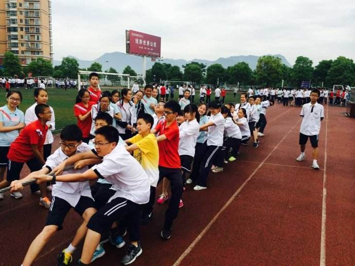

          
            
**2018.09.14**

***有的小朋友对我说不想上小学，因为减法太难了，其实小学里有趣的事可多了，包括减法在内。***

这次我们来说说上小学时的拔河比赛吧。

拔河为双方各执绳一端进行角力的体育活动，属于中国的传统运动项目。

比赛前，会准备一条很粗很长的麻绳，中间系上一块红布。

两个队伍同学站在两侧抓好绳子，离绳子最近的人脚下有条白线，人不能超过白线，红绳子要在白线中间。

开始前，双方把绳子拉直，随着一声哨响，比赛开始，双方就使出吃奶的劲把绳子往自己这边拉。

谁能把中间的红布先拉过自己这边的白线就算赢。

这个比赛一般都是男同学参加，中间点缀几个女同学。

要注意带上手套，否则很容易把手掌磨破。

***最近喜欢的诗***
>长大后，最新会背的一首诗
过零丁洋
辛苦遭逢起一经，干戈寥落四周星。
山河破碎风飘絮，身世浮沉雨打萍。
惶恐滩头说惶恐，零丁洋里叹零丁。
人生自古谁无死？留取丹心照汗青。

**个人微信公众号，请搜索：摹喵居士（momiaojushi）**

          
        