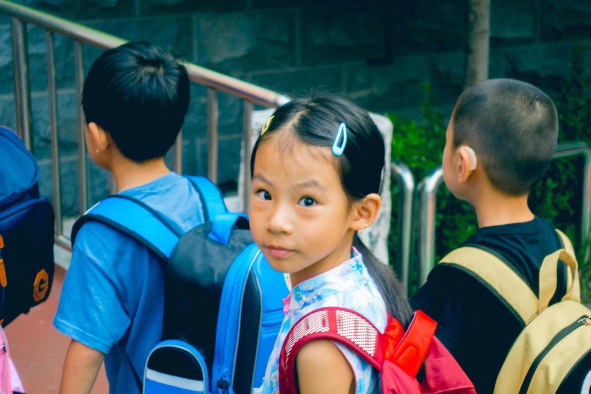

          
            
**2018.09.18**

2018年8月26日，是个周日。

这天是喵上小学的第一天，学校安排了3天的试上学，每天上半天。

学校选周日这个时间非常高明，艰巨的第一天，父母正好可以一起上阵。

到校时间定在8点10分，比正式上学要晚很多，给孩子们一些适应的时间。

一个家长和孩子一起在门口排队，送孩子进操场，去找自己的班主任老师。

班主任老师给孩子们排队，家长们在操场另一侧等候。

老师们带孩子进教学楼后，等候的家长就可以离校。

一切安排得秩序井然。

中午11点半，老师们会带着孩子们排队出校门，来到每个班的集合点和家长们见面。

见到家长的孩子们就和家长走，没看到家长的孩子继续留在老师身边。

第一天大家在班上随便坐，每个人轮流进行自我介绍，认识教室，自己打水，上厕所。

就这样，喵的小学第一天完成啦。

回忆三十年前，似曾相识的一天。

***最近喜欢的诗***
>长大后，最新会背的一首诗
过零丁洋
辛苦遭逢起一经，干戈寥落四周星。
山河破碎风飘絮，身世浮沉雨打萍。
惶恐滩头说惶恐，零丁洋里叹零丁。
人生自古谁无死？留取丹心照汗青。

**个人微信公众号，请搜索：摹喵居士（momiaojushi）**

          
        