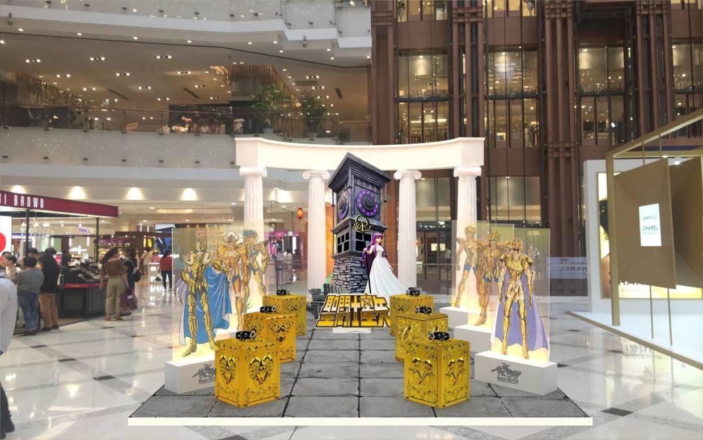

          
            
**2018.09.20**

前段时间，好像是朝阳大悦城搞了一个圣斗士三十周年展，身边好多朋友都去看了，多有感慨。

回忆一下圣斗士，这个还是我接触到的第一本真正意义的漫画书。

印象是有一年，姑姑给我们新年礼物，我和姐姐各得到一本漫画书，我那本剧情完全不记得了，好像有点恐怖。

我姐姐那本就是《燃烧吧，天马》，当时我看得很入神，从此一发不可收拾，经常在书报亭等着新版。

那时1本1.9元，一卷是5本，一出新版，赶紧去学校通知大家，有同学去买，我们就可以蹭书看。

最后冥斗士的大结局是在我姐那里看的，非常完美。

很多年后又看了《Lost Canvas》也非常不错。

2018年元旦去日本，还想买一本圣斗士第一册，可以无缘相见。

现在回忆当年第一次读时的情景，还是充满了幸福。

***最近喜欢的诗***
>杜甫的天下第一律诗，对仗真是绝妙啊
登高
风急天高猿啸哀，渚清沙白鸟飞回。
无边落木萧萧下，不尽长江滚滚来。
万里悲秋常作客，百年多病独登台。
艰难苦恨繁霜鬓，潦倒新停浊酒杯。

**个人微信公众号，请搜索：摹喵居士（momiaojushi）**

          
        