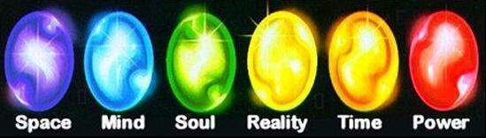

          
            
**2018.09.25**

>无限宝石（过去被称为“灵魂宝石”）为漫威漫画中的六件虚拟宝石，分别控制力量、时间、空间、灵魂、现实和心灵。
人们往往说某些看法是真实的，而使用这颗宝石可以真切地、毫不夸张地把这些看法化为真实。这颗宝石也许是最强大的，同时也是最难使用的。使用它，人们可以实现任何的梦想。一切科学守则和自然规律在它的面前都毫无意义，因为它可以任意修改它们。现实之石不仅仅是能够制造和真实毫无区别的幻想，只要使用者愿意，它可以完全变成现实。

在《复仇者联盟3》播出后，我和喵反复地参详了很多遍，片子中的各个细节，都成了我们津津乐道的谈资。

其中现实宝石的能力，被我们说成是做PPT的法宝，随便就能改变形状，只做出各种幻象，迷惑对手。

其中灭霸使用现实宝石在虚无之地对付了银河护卫队，在泰坦星上演示了曾经兴盛的泰坦星。

喵经过深思熟虑后，告诉我：
>现实宝石虽然叫现实，但是做的都是不现实的事。

嗯嗯，真是深入思考了这个问题，这些时间并没有白费。

***最近喜欢的诗***
>杜甫的天下第一律诗，对仗真是绝妙啊
登高
风急天高猿啸哀，渚清沙白鸟飞回。
无边落木萧萧下，不尽长江滚滚来。
万里悲秋常作客，百年多病独登台。
艰难苦恨繁霜鬓，潦倒新停浊酒杯。

**个人微信公众号，请搜索：摹喵居士（momiaojushi）**

          
        