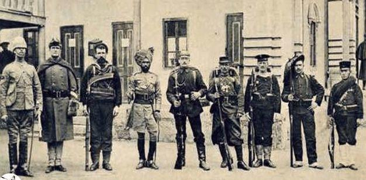

          
            
**2018.09.27**

>八国联军侵华战争（Siege of the International Legations）指公元1900年5月28日（清光绪二十六年），以当时的大英帝国、美利坚合众国、法兰西第三共和国、德意志帝国、俄罗斯帝国、日本帝国、意大利王国、奥匈帝国为首的八个主要国家组成的对中国的武装侵略战争。
1900年春，义和团运动成为了八国联军侵华战争的导火索，以此为借口，八国联军以镇压义和团之名行瓜分和掠夺中国之实。

侵华的联合国军总人数前后约为5万人，装备精良，声势浩荡，1900年8月14日，北京城彻底沦陷，八国联军所到之处，杀人放火、奸淫抢掠！从紫禁城、中南海、颐和园中偷窃和抢掠的珍宝更是不计其数！八国联军总司令瓦德西在后来也承认，‘’所有中国此次所受毁损及抢劫之损失,其详数将永不能查出,但为数必极重大无疑。‘’1901年9月7日，以《辛丑条约》的签订为结果，中国自此彻底沦为半殖民地半封建社会，给当时的国家和人民带来了空前沉痛的灾难。

八国联军侵华是我们很熟悉的，签订了《辛丑条约》，陪了4.5亿白银，杀人放火等等。

然而，对于大清朝来说，八国联军真正毁灭的是什么呢？

应该是大清朝的忠君保守派。

八国联军侵华的起因是义和团运动，慈禧手下的保守派们利用义和团去扶清灭洋，一败涂地后，慈禧为了自保，被迫交出了朝廷的保守派们。

大部分朝廷的死忠被砍头或者终身流放，李鸿章折腾完条约后也终于一命呜呼。

从此，终于清庭的满洲贵族势力基本被荡平，到了末年只剩下一个张之洞免礼维持。

张之洞去世后，监国摄政王载沣完全被袁世凯玩弄于股掌之间，一点点交出了权力。

倘若此时，死硬派能留下一两位，局势绝不会至此。

忠于自己的，还能干活的人一个都没有，就只能被别人牵着鼻子走了。

***最近喜欢的诗***
>杜甫的天下第一律诗，对仗真是绝妙啊
登高
风急天高猿啸哀，渚清沙白鸟飞回。
无边落木萧萧下，不尽长江滚滚来。
万里悲秋常作客，百年多病独登台。
艰难苦恨繁霜鬓，潦倒新停浊酒杯。

**个人微信公众号，请搜索：摹喵居士（momiaojushi）**

          
        