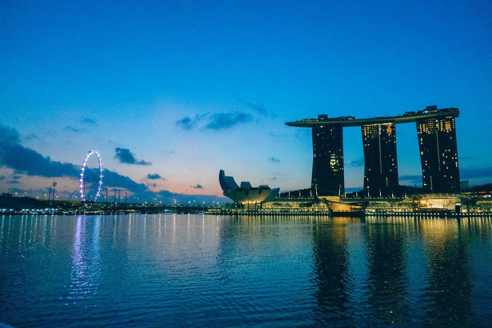
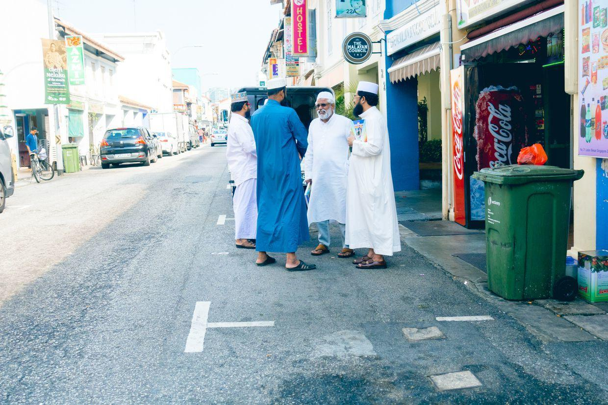
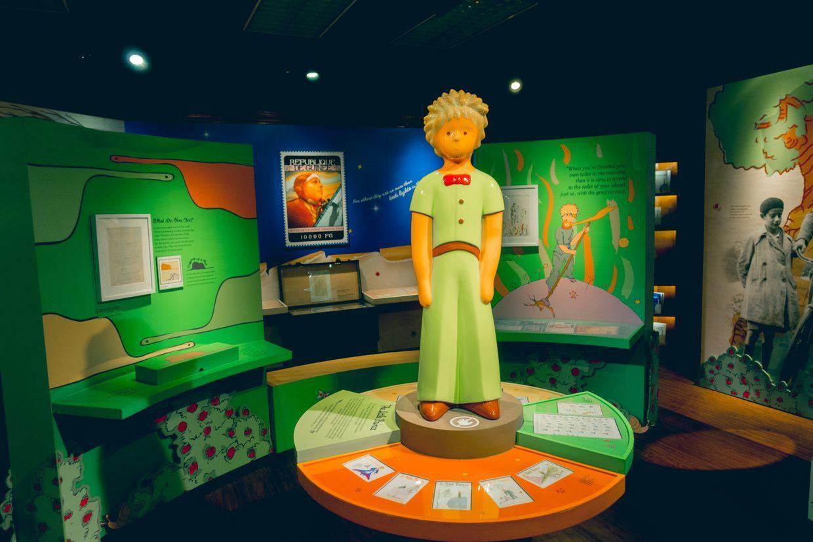
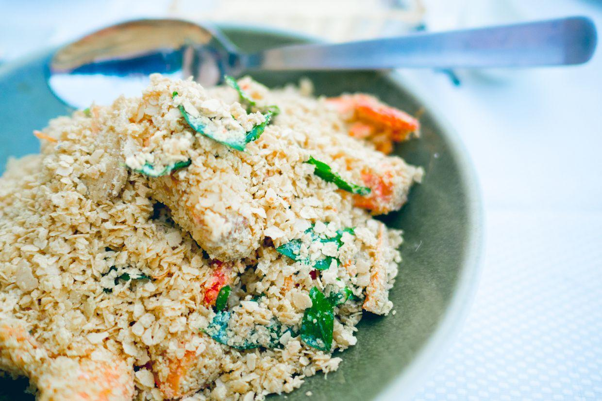

          
            
**2018.10.02**

新加坡之旅第二天啦，一早起床去看日出。

确实很惊人，金沙酒店的日出。

各个角度都很美。

海湾的高楼大厦灯火通明。

早上去吃饭，一路的绿树。

美丽的小花。

早餐店，排队。

咖啡椰奶烤面包，服务态度很差，爱搭不理。

一个人的早餐店。

空中花园。

一路兴奋地聊天。

突然出现的艺术品。

各种美丽的花。

前两句还不错，后两句差点。

绿树多得如麻。

一尘不染的大路。

到了阿拉伯街。

清真寺。

遇到了飘逸的小花。

路上不怕人的小鸟。

各个肤色的小朋友们一起游戏。

又到了一个清真寺。

非常壮观。

进去参观前，要脱鞋，穿袍子。

还挺漂亮。

里面早有人开始礼拜。

去小印度。

老师给学生们讲解如何穿沙丽。

开始挑选小玩儿意。

看得眼花缭乱。

印在手上的纹身。

很漂亮的街道。

印度教寺庙。

善男信女们。

买了2个小挎包。

吃到了很辣的咖喱。

漂亮的壁画。

纹身可以脱模了。

一起合影。

去吃饭，烧鸭。

小锅面。

中午睡个大觉，下午去逛街

圣安德烈教堂。

喵说好像城堡。

高耸入云。

开心地合影。

进去参观一下。

彩色玻璃。

去集邮博物馆，遇到小王子展览。

好多邮票。

展品很多。

很梦幻。

不虚此行。

星星来的。

五彩的政府大楼。

大名鼎鼎的肉骨茶。

三块排骨。

味道很不错。

吃个草莓冰激凌。

阳光很温和。

去吃珍宝蟹，等了好久。

哈哈哈。

大虾先上了，燕麦非常香。

一个合影。

终于上来了，味道非常棒，绝对值得一试。

在克拉码头等着坐船。

出发啦。

坐船看金沙酒店的激光秀。

太精彩了，眼花缭乱。

完全被震撼了。

封面

晚上回酒店，泡个澡，好好休息休息。

明天准备去动物园。

***最近喜欢的诗***
>贾岛的诗，重大的意义在于，诞生了推敲这个词。
题李凝幽居
闲居少邻并，草径入荒园。
鸟宿池边树，僧敲月下门。
过桥分野色，移石动云根。
暂去还来此，幽期不负言。

**个人微信公众号，请搜索：摹喵居士（momiaojushi）**

          
        