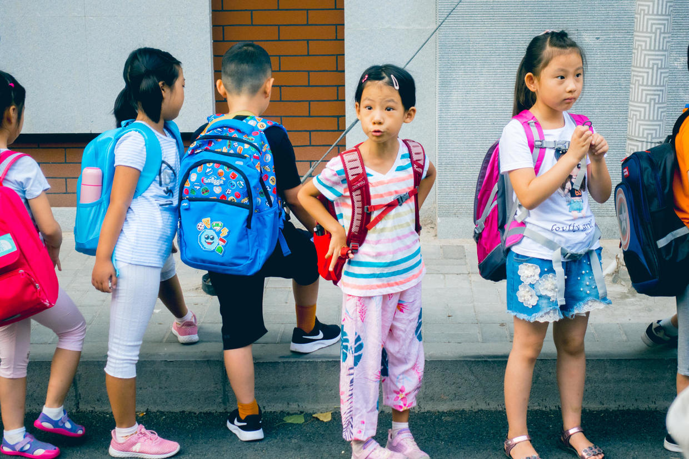
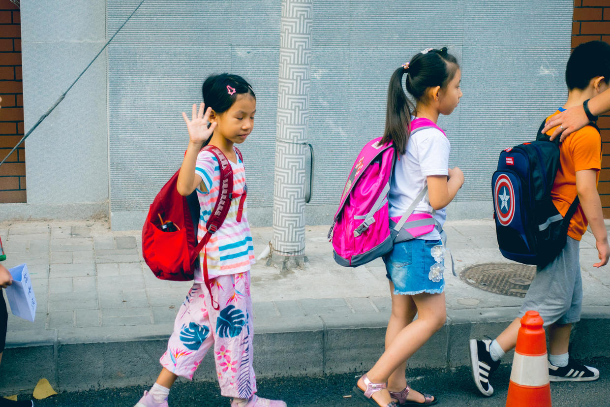
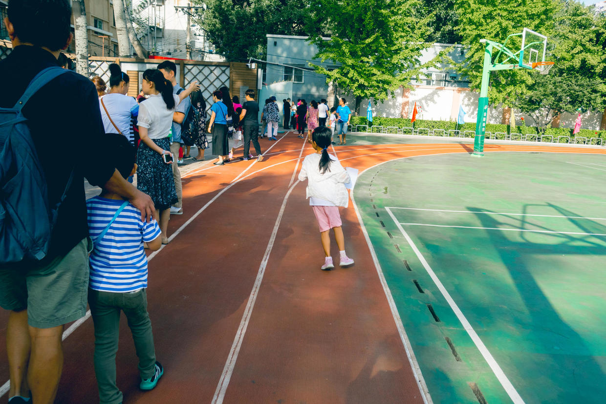

          
            
**2018.10.09**

喵的小学生涯终于开始啦。

令我们震惊的是，在新的生活中，她表现出了很独立的一面。

在学校门口排队，很大气地向我们挥手致意，自己走进校门。

封面

周五早上开学典礼，可以有一位家长可以进入学校，送孩子去自己班级的队伍。

喵妈唯恐喵找不到队伍，要亲自带她进去，没想到喵让喵妈赶紧回去，自己一个人就跑去找自己的老师了。

这还让喵妈有那么一瞬间的小失落，不过马上就对她这以前很少见的独立精神感到欣慰。

晚上我们问她，教室怎么走？

喵说不知道。

我问：
>那你怎么找到教室啊？

喵说：
>我跟着我们班的一个同学，一起找到教室。

既有独立精神，行动上又能跟随着别人，孺子可教也。

***最近喜欢的诗***
>贾岛的诗，重大的意义在于，诞生了推敲这个词。
题李凝幽居
闲居少邻并，草径入荒园。
鸟宿池边树，僧敲月下门。
过桥分野色，移石动云根。
暂去还来此，幽期不负言。

**个人微信公众号，请搜索：摹喵居士（momiaojushi）**

          
        