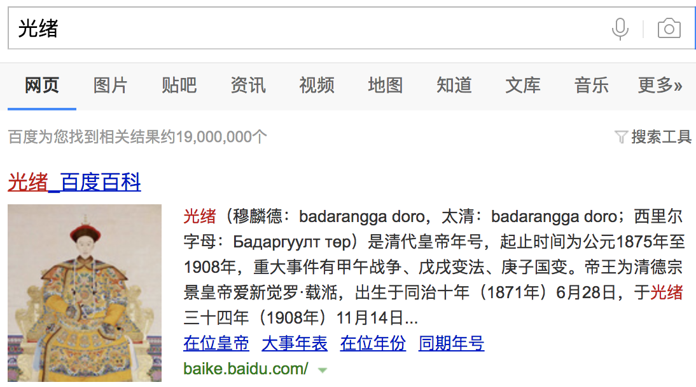

          
            
**2018.10.18**

>爱新觉罗·载湉，清德宗，光绪皇帝，清朝第十一位皇帝。四岁登基，起初由慈安、慈禧两宫太后垂帘听政，光绪七年慈安太后崩逝后由慈禧太后一宫独裁，直至光绪帝十八岁亲政，此后虽名义上归政于光绪帝，实际上大权仍掌握在慈禧太后手中。

光绪帝一生受到慈禧太后的挟制，未曾掌握实权。1898年，光绪帝实行“戊戌变法”，但却遭到以慈禧太后为首的保守派的抵触，光绪帝被慈禧幽禁在中南海瀛台。整个维新不过历时103天，故称“百日维新”。1908年，光绪帝驾崩于慈禧太后死亡前一天，享年38岁，葬于清西陵的清崇陵。

光绪皇帝从执政时间上来看，竟然有34年，时间在清朝皇帝中也算名列前茅了。

然而这三十多年，都是在做慈禧太后的傀儡。

好不容易熬到一次还政，立刻搞了甲午战争和戊戌变法，结果是一塌糊涂。

慈禧太后一句：
>痴儿，今日无我，明日焉有汝乎？

就把大权收回了。

有人说，光绪皇帝应该学嘉庆，一直隐忍到慈禧去世。

这个实在是不现实，慈禧和光绪年纪差距可没有那么大，这要求光绪能隐忍几十年。

光绪也不像嘉庆，独立成长，受过正统教育。

光绪的心智，加上时局的动荡，也让他没法等下去。

真是有点像文天祥写的：
>山河破碎风飘絮，身世浮沉雨打萍。

***最近喜欢的诗***
>长大后，最新会背的一首诗
过零丁洋
辛苦遭逢起一经，干戈寥落四周星。
山河破碎风飘絮，身世浮沉雨打萍。
惶恐滩头说惶恐，零丁洋里叹零丁。
人生自古谁无死？留取丹心照汗青。

**个人微信公众号，请搜索：摹喵居士（momiaojushi）**

          
        