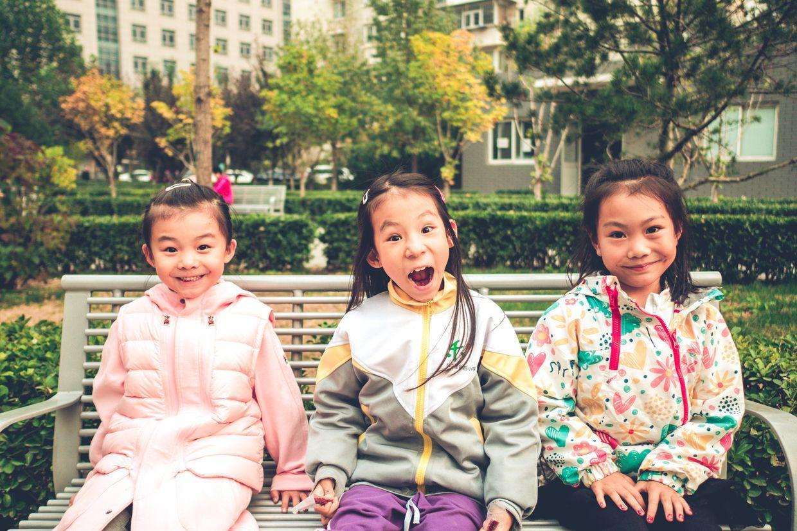

          
            
**2018.10.21**

周日啦，今天和兜妹、悦妹、敦敦弟弟一起聚会。

敦敦弟弟又长大了，推着小车玩儿。

一进门就开始互送礼物。

玩儿起了桌面足球游戏。

敦敦弟弟能拎着小车走走了。

玩儿起了爷爷平时健身的单杠。

敦敦弟弟也玩儿起了足球。

也来尝试一下单杠。

抱着坐在单杠上还挺开心。

沙发上一骨碌就能站起来。

靠在靠背上，很稳当。

中午吃饭啦。

吃过饭，组了个乐队玩儿起来。

开始互相涂指甲。

下午出门一起玩儿。

银杏树开始黄了。

跑得非常快啊。

一起合影啦。

起飞啦。

封面

去吃好吃的蛋仔。

敦敦弟弟自己扶着2把椅子，一点点往前走。

笑容真是灿烂啊。

一天很快就过去了，看着墙上的春节全家福，觉得一年好快又要过去了。

***最近喜欢的诗***
>长大后，最新会背的一首诗
过零丁洋
辛苦遭逢起一经，干戈寥落四周星。
山河破碎风飘絮，身世浮沉雨打萍。
惶恐滩头说惶恐，零丁洋里叹零丁。
人生自古谁无死？留取丹心照汗青。

**个人微信公众号，请搜索：摹喵居士（momiaojushi）**

          
        