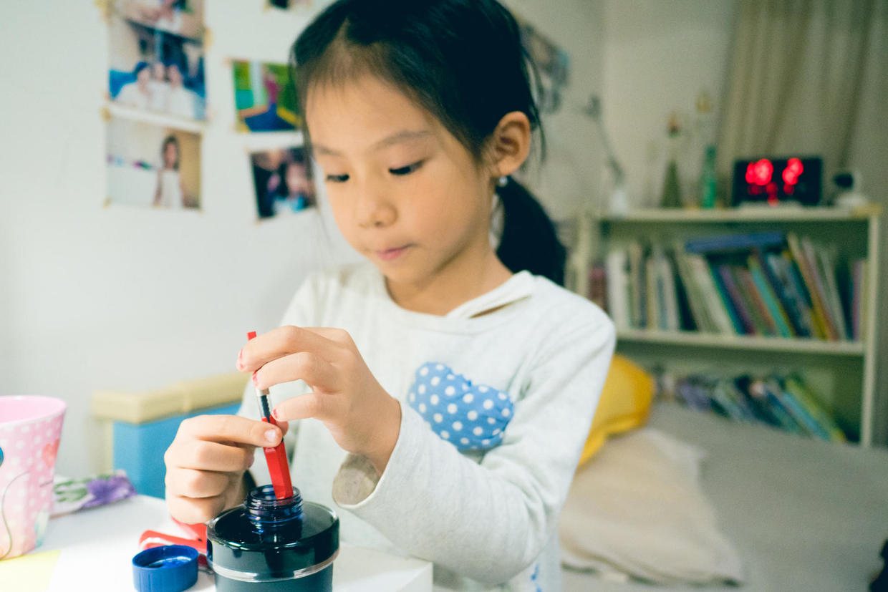

          
            
**2018.10.22**

**拍摄时间：2017.12.10**

**拍摄地点：家里**

这张照片时2017年在家里拍的。

当时新买了钢笔和墨水，还有横线本子，来记录喵的生活日程。

打开墨水瓶，教了喵怎么灌钢笔水，她自己兴致勃勃地开始玩了起来。

说到日程，我们每天会在本上写下来今天要做什么，吃饭、喝水、画画、午睡、练琴、上英语课、刷牙、用牙线等等。

然后第二天，喵自己看看哪些做了，哪些没做，自己来打勾。

这个活动坚持了几个月，还是结束了。

首先是，钢笔不好使，我们晚上，躺在床上，靠着垫子，勾决这些项目时，笔因为倾斜，往往不出水。

而且钢笔墨胆装水太少，经常要灌，很麻烦，看来钢笔进入历史是有道理的。

另外，本经常忘了带，不方便，而且大部分日程都是一样的，实在是有些浪费。

所以，还是继续在有道云上记录了。

***最近喜欢的诗***
>贾岛的诗，重大的意义在于，诞生了推敲这个词。
题李凝幽居
闲居少邻并，草径入荒园。
鸟宿池边树，僧敲月下门。
过桥分野色，移石动云根。
暂去还来此，幽期不负言。

**个人微信公众号，请搜索：摹喵居士（momiaojushi）**

          
        