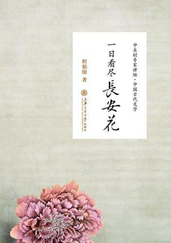

          
            
**2018.10.24**

非常棒，很多诗词的细节和创作背景都介绍了。
<h2>2018.05.22（周二）</h2>
<h3>《一日看尽长安花》 - 01</h3>
>第一讲关关雎鸠在河洲——先秦神话和诗歌

在殷商时期，文字有两种，一种叫金文，是刻在铜器上面的文字；一种叫甲骨文，是刻在甲骨上的文字。甲骨文从公元前1400年开始产生，一直到公元1899年才被重新发现。

金文和甲骨文
>马克思主义认为，所谓神话是人们用一种幻想的形式战胜自然。

精神战胜
>从时间上说，《诗经》是西周初年，到春秋中期，大约公元前600年前后。

《楚辞》到什么时候呢？是到战国的中期，作者是屈原，他生在公元前340年，生年大体是没有疑问的，可以从《离骚》得到考证；但他的卒年公元前277年是有疑问的。您不要记这么细，只要记住一个大历史坐标，就是公元前300年。

诗经和楚辞是先秦诗歌
>而屈原的作品《楚辞》保留下来是25篇，其中有3篇是伪作。其中最有名的作品是《离骚》。而《诗经》中最有代表性的是《国风》，因此中国有个词，叫“风骚”。

国风和离骚，出现风骚
>在艺术表现方面，《诗经》最大的特色，最多的手法是“比兴”。所谓“比”，以此物比彼物，如说，她的脸像苹果一样；

所谓“兴”，是先描写一件事物作为开头，但下面写的并不是这件东西，而是别的。我举一个例子，你就知道了。如“山丹丹开花那个红艳艳，革命人民跟着毛泽东”，“山丹丹开花”与“跟着毛泽东”是没关系的，它是一种兴起，不能一张嘴就唱“跟着毛泽东”。

说主席，先说山丹丹开花，这是兴
>“关关雎鸠，在河之洲。窈窕淑女，君子好逑。”用雎鸠鸟和鸣来比喻男女之间的爱情永久、纯洁，这是“比”。先写“关关雎鸠，在河之洲”，然后写“窈窕淑女，君子好逑”，叫“兴”，所以叫“比兼兴”。“

比喻和顾左右而言他结合
>第二讲百家争鸣写春秋——先秦散文

第一部历史散文是《春秋》，它非常简明，相传是孔子所作。在记载历史的时候，该称赞的就称赞，该批评的就批评。

先秦的散文
>后来，历史学家用很多历史资料来丰富它，写成了三部著作，叫“春秋三传”：一个是《公羊传》，一个是《穀梁传》，一个是《左氏传》。这三部著作是丰富和解释《春秋》的。

在“春秋三传”中，最有名是《春秋左氏传》，简称《左传》。《左传》相传是左丘明所作。他在记载事件方面非常生动，非常详细。他描写战争非常生动，对后来的小说，特别是军事题材的小说有着非常深刻的影响。这是第二部。

左传是春秋的注释
>我认为在中国典籍中，《论语》是最伟大的一部书。它有20篇，511条，15925个字，我曾一个字一个字地数过。我把《论语》每天带在身边，坐在车子里，有时间就打开来读一读，“学而时习之，不亦说（古悦字）乎”，什么时候想读，就打开来读一读，非常好。

论语读起来很简单
>当然老子也有“小国寡民”的思想，他认为“鸡犬之声相闻，老死不相往来”是一个理想的王国。

反科技
>明日，弟子问于庄子曰：“昨日山中之木，以不材得终其天年，今主人之雁，以不材死；先生将何处？”庄子笑曰：“周将处乎材与不材之间。

太有道理了
>孔鲤又生了个儿子，叫孔伋。孔伋是著名的儒学思想家，而孔鲤则是个非常平庸的人，但是他有一句话很不平庸。孔鲤对他爸爸说，你的儿子不如我的儿子，“你子不如我子”；而他对自己的儿子说，“你父不如我父”，很谦虚的，就他不行。

对自己挺能讽刺
>孟子的文章则是高屋建瓴，气势磅礴，具有一种内在的让你不得不服的力量。如“天时不如地利，地利不如人和”，他强调人和的作用。

战国时期，没时间讨论，直接教导你
<h2>2018.05.23（周三）</h2>
<h3>《一日看尽长安花》 - 02</h3>
>王选夫妇没有孩子，他去世时我为他写了一副挽联，是集句联。上联是取自杭州西湖岳飞坟前的“青山有幸埋忠骨”，那一联的下联原是“白铁无辜铸佞臣”，而我用“白云无尽是儿孙”为对。

妙句
>王维有一首诗《竹里馆》：“独坐幽篁里，弹琴复长啸。深林人不知，明月来相照。”写得非常幽静。

既巧妙，又押韵
>南北朝有位诗人叫王藉，他有两个名句：“蝉噪林逾静，鸟鸣山更幽。”这都是以动写静，动中有静。

矛盾的统一
>让我们比较一下唐代诗人高适的作品，他有一首诗歌《别董大》。这首诗也是前两句写景，后两句抒怀：

千里黄云白日曛，北风吹雁雪纷纷。莫愁前路无知己，天下谁人不识君！

豪迈
>李白和杜甫是好朋友，在公元744年时，他们相逢在东都洛阳，结下深厚友谊，分手后再也没重逢过，分别即为永别。

好多事，不能这么想
>杜甫一张嘴就夸耀自己奉儒守官的家庭非常好：“诗是吾家事”，“吾祖诗冠古”，他的祖父是初唐诗人杜审言。李白从来不夸耀家庭，而是说“天生我材必有用”。

原来如此啊，难怪张狂，原来是不自信
>李白在安徽时，泾县农村有个人叫汪伦，他非常崇拜李白。原来以为汪伦是农民，后来考证他是小地主，这无关紧要。他非常希望李白来他们村玩玩。他知道李白第一喜欢大自然，第二喜欢美酒，就写了封信给李白，告诉李白说：我们这里有“万家酒店，十里桃花”。李白一看，这地方好呀，就去了。李白去了一看，这是个小村庄，哪里有什么万家酒店！就问汪伦：万家酒店何在？汪伦笑嘻嘻对李白说，你来看看，指给李白看一家酒店的酒旗上写有“万家酒店”，原来开酒店的老板姓万，他开的酒店不就是万家酒店吗。李白又问：十里桃花何在？他就指给李白看外边的一个桃花潭。李白很高兴，走的时候写了一首诗《赠汪伦》：

李白乘舟将欲行，忽闻岸上踏歌声。桃花潭水深千尺，不及汪伦送我情。

聪明啊，万家酒店和十里桃花潭
>第八讲乌衣巷口夕阳斜——中唐诗歌

忽闻海上有仙山，山在虚无飘渺间。

白居易的长恨歌，非常巧妙还押韵
>刘禹锡有几首学习民歌的绝句写得很好，如《竹枝词》：杨柳青青江水平，闻郎江上唱歌声。东边日出西边雨，道是无晴却有晴。

晴和情
>孟郊一生非常贫寒，做过小官。他有一首小诗，写自己搬家：“借车载家具，家具少于车。”

慈母手中线，游子身上衣。临行密密缝，意恐迟迟归。谁言寸草心，报得三春晖。

真是苦
<h2>2018.05.24（周四）</h2>
<h3>《一日看尽长安花》 - 03</h3>
>李商隐的无题诗，在我看来，主要就是爱情诗。如写两个人一见如故，可是在当时条件下无法倾心相谈：“身无彩凤双飞翼，心有灵犀一点通。”

害死犀牛了
>君问归期未有期，巴山夜雨涨秋池。何当共剪西窗烛，却话巴山夜雨时。

为什么要“剪烛”？说明重逢时，互相交谈了很长很长时间，蜡烛需要再剪当中的烛芯才能更明亮一点。

这首诗巧妙在哪里呢？收到信是“巴山夜雨”时，诗歌设想相逢时谈话的内容正是“巴山夜雨时”，即现在我是如何想念你，这会成为将来相逢时的谈话内容。整首诗歌一往情深，明白晓畅；而在结构上回环往复。

非常巧妙的结构
>诗歌第二句的“断魂”就是“销魂”，是表示人的精神极度兴奋，或者极度悲伤。

销魂表示极度
>词有词牌，词调，一共有820多个调子和不同的样式，这在古今中外所有的诗词当中都是没有的，而且这种样式都固定下来了。

可惜没有曲子了
>在这类800多个词牌中，惟独有两个词牌，其内容基本上一直不变。第一个就是《渔歌子》，从唐朝，到宋元明清，一般写《渔歌子》都是写隐逸生活，写渔父生活，写隐逸情怀。没有人用《渔歌子》来写谈恋爱的。而且风格都是清新明快，内容风格相当稳定。另外一种词牌就是《长相思》，我已选了160首，拟以《百首长相思》成书。当中的“百”谐音相关“白”。我将所有《长相思》都找出来，只有几首是例外，绝大多数都是写男女爱情。

渔歌子田园，长相思爱情
>这里只讲讲后主李煜，他前半生做皇帝，因此那时的词都是写男欢女爱，相思离别。例如他与小周后相好，有词句：“刬袜步香阶，手提金缕鞋。”“刬袜”是脱鞋后光穿袜子，怕走路出声音，她就这样去约会。

最大的变化就是他有切身的亡国之痛，他把这种深切的痛苦写到词里，使中国的词发生了非常大的变化。

也就是说，词不再只是写男欢女爱、相思离别的内容，而写亡国之痛。例如他写的《虞美人》：春花秋月何时了，往事知多少！小楼昨夜又东风，故国不堪回首月明中。雕栏玉砌应犹在，只是朱颜改。问君能有几多愁，恰似一江春水向东流。

后主的词真是不得了，前期后期
>第十讲大江东去浪淘沙——两宋金元文学

有个重要词人晏殊，他有《浣溪沙》：一曲新词酒一杯，去年天气旧亭台，夕阳西下几时回？无可奈何花落去，似曾相识燕归来。小园香径独徘徊。据说他当时吟得“无可奈何花落去”后，一时想不出下一句，问他手下的王琪，王应声答道：“似曾相识燕归来”。

妙手偶得啊
>他原名三变，求取功名多因名声不太好而不被录取，他写了一首《鹤冲天》，说自己无意功名：“忍把浮名，换了浅斟低唱！”一次考试，放榜前，皇帝宋仁宗一看是柳三变，便说：“此人风前月下，好去浅斟低唱，何要浮名？且填词去。”他索性自我解嘲，说自己是“奉旨填词”。后来改名为柳永，应试才取了。

号称奉旨填词
>柳永还有一首送别的词很有名，叫《雨霖铃》：寒蝉凄切，对长亭晚，骤雨初歇。都门帐饮无绪，留恋处、兰舟催发。执手相看泪眼，竟无语凝噎。念去去千里烟波，暮霭沉沉楚天阔。多情自古伤离别，更哪堪、冷落清秋节！今宵酒醒何处？杨柳岸、晓风残月。此去经年，应是良辰好景虚设。便纵有千种风情，更与何人说？

绝了
>苏东坡一次问其善讴的幕士：“我词何如柳七？”回答说：

“柳中郎词，只合十七八女郎，执红牙板，歌‘杨柳岸，晓风残月’；

学士词，须关西大汉，铜琵琶、铁绰板，唱‘大江东去’。”“东坡为之绝倒。”他抓住了不同词人的不同词风。

抓住特点的回答
<h2>2018.05.25（周五）</h2>
<h3>《一日看尽长安花》 - 04</h3>
>黄庭坚特别喜欢读《汉书》，一次到他岳父家，吃过晚饭，他就提了一壶酒，进书房读《汉书》。第二天早上一壶酒就没有了，第二天又是这个样子。他的岳父感到很惊讶，悄悄地看他是怎样喝酒的。看到他打开《汉书》，他读到张良指使勇士去刺杀秦始皇，一椎棰下，没有打到始皇，误中了副车，他一拍桌子：“惜乎未中矣！”然后满饮一杯。又读到一个地方，“哎呀！没有弄好呀”，又饮一杯。他的老丈人在门边听后说：“有如此下酒物，一斗诚不多矣！”在座的先生们，晚上可以一边读唐诗一边喝酒，读到“人生得意须尽欢，莫使金樽空对月”时，满饮一大杯。黄庭坚的词就不说了。

用《汉书》下酒
>秦观的诗歌也写得比较柔弱，有“有情芍药含春泪，无力蔷薇卧晓枝”之句

真柔美
>第十一讲青山几度夕阳红——明代文学

明代文学中最有成就的是小说，其次是戏剧；诗词散文也取得了一定的成就，但已经不能超越唐宋时期。

小说来了
>宋代的讲史话本，因为比较长，说话人开始把故事分成若干讲，每讲一次，等于后来小说的一回；每一次讲说之前，编一个题目向听众揭示主要内容，这就是章回体小说的起源。《三国演义》是章回体小说的开山之作，它已经不再是说话人的底本，而是供人们案头阅读的读本。

章回体小说
>作者避开了正面描写，写关羽在“其酒尚温”的短暂时间里，就将连杀曹操二将的华雄人头提来，可见关羽是如何的神勇无敌。“其酒尚温”，神来之笔！

确实是神来之笔

41urBZ7OeyL.jpg

***最近喜欢的诗***
>贾岛的诗，重大的意义在于，诞生了推敲这个词。
题李凝幽居
闲居少邻并，草径入荒园。
鸟宿池边树，僧敲月下门。
过桥分野色，移石动云根。
暂去还来此，幽期不负言。

**个人微信公众号，请搜索：摹喵居士（momiaojushi）**

          
        