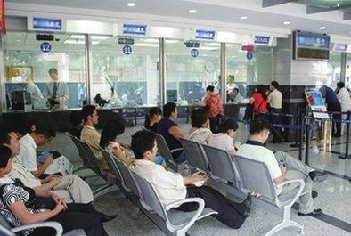

          
            
**2018.10.25**

最近突然想起了排队的事情，不禁回忆了一下童年的经历。

隐约中，有个朦胧的印象，是去银行排队。

估计那时还是小学一二年级，父亲带我去银行取钱，那时还叫储蓄所。

储蓄所里面人并不是很多，非常干净，没有人喧哗，好像是个很神圣的场所。

父亲到柜台前，领会一个圆形的小铁牌，让我拿着。

铁牌上有个号码，就像今天取号机里取出的小条。

至于叫号，自然还是人工的，叫到号的，拿着贴牌去柜台办理业务。

然而到了90年代末，这种叫号制度好像就没有了，去储蓄所排队，全凭运气。

运气好，这一队很快结束，运气不好，前面有个存几十万的人，要等上半天。

最气人的是，那时还要填表，很复杂，填错了就要去重新填，然后重新排队。

每次去银行，都是惴惴不安，谨小慎微，提心吊胆。

所以，今天看来，还是进步了很多的。

***最近喜欢的诗***
>贾岛的诗，重大的意义在于，诞生了推敲这个词。
题李凝幽居
闲居少邻并，草径入荒园。
鸟宿池边树，僧敲月下门。
过桥分野色，移石动云根。
暂去还来此，幽期不负言。

**个人微信公众号，请搜索：摹喵居士（momiaojushi）**

          
        