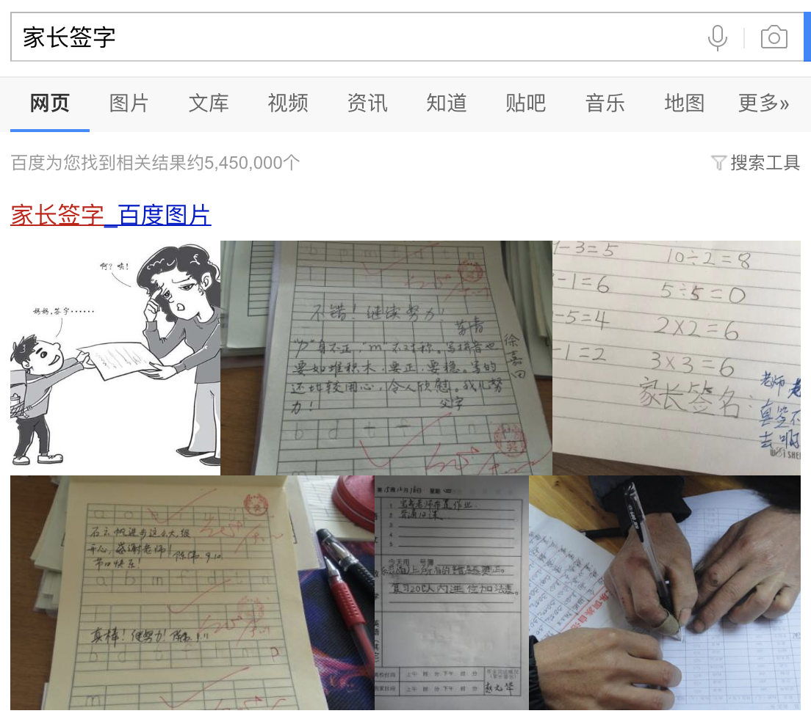

          
            
**2018.10.26**

***有的小朋友对我说不想上小学，因为乘法太难了，其实小学里有趣的事可多了，包括乘法在内。***

这篇我们来说一下家长签字吧。

这段时间的小学生活，你已经经历过语文、数学和英语的单元测试。

每次考完试，老师的卷子发下来，都会让你改错题，然后拿回家让家长签字，第二天再交回去。

我的小时候，也是这个样子。

考试是检验你学习成果的最好方法，家长签字，是为了让家长知道你的学习成果。

并且和你一起总结经验教训，查缺补漏。

语文的卷子错了一道题，这道题还是之前反复给我讲的脱帽问题。

所以，看题审题很重要，不要慌张。

数学错了2道题，画圈圈数字没有画出完整的圆圈，还是没有审好题。

英语是满分，但是stand up理解的不太对，说成了sit up，虽然答案对了，但是知识还不牢固。

看，这就是让家长签字的作用，和你一起分析遇到的问题。

***最近喜欢的诗***
>贾岛的诗，重大的意义在于，诞生了推敲这个词。
题李凝幽居
闲居少邻并，草径入荒园。
鸟宿池边树，僧敲月下门。
过桥分野色，移石动云根。
暂去还来此，幽期不负言。

**个人微信公众号，请搜索：摹喵居士（momiaojushi）**

          
        