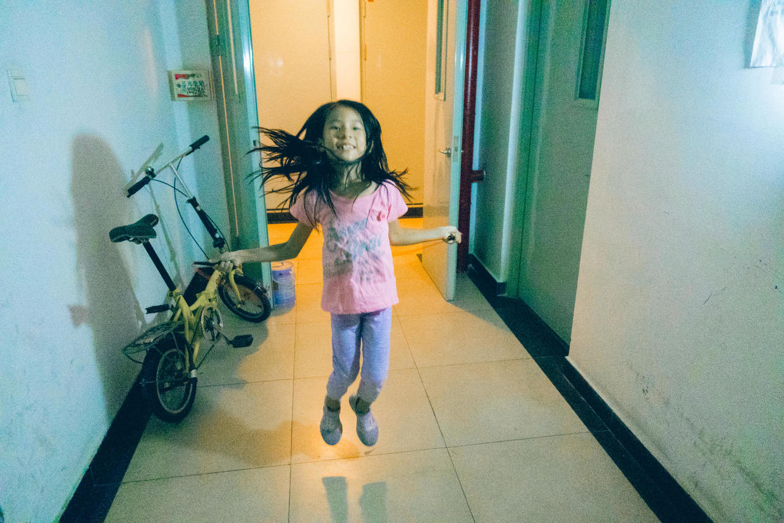

          
            
**2018.10.30**

开学好长时间了，基本上每天晚上都会坚持跳绳锻炼一下。

从一开始跳总是10个，慢慢往上加，15、20、25、30。

最近一段时间，跳30个非常非常轻松，于是我们又加到了40，虽然有点累，但是第一次完成基本没问题。

最开始跳绳时，经常会让她注意腿不要分太开，跳得也不要太高。

她总是听不进去，不过随着时间的推移，她的身体开始慢慢适应这项运动，进行自动调整。

腿渐渐并拢，离地也没有那么高了。

聪明的身体开始自己协调起来了。

看来技术不管怎么说，还是要靠大量练习来实现。

而且，在大量练习的过程中，身体也会趋利避害地适应协调起来。

最近又开始联系蹬三轮了，没想到竟然只会迈左腿，迈右腿就会要摔倒。

经过反复训练，明显好转一点，可以缓慢一顿一顿地两只腿交替。

路漫漫啊，继续求索。

***最近喜欢的诗文***
>以前只听说过逍遥游开头的名句，自己读了以后，才发现后面更有道理
逍遥游节选
且夫水之积也不厚，则其负大舟也无力。覆杯水于坳堂之上，则芥为之舟，置杯焉则胶，水浅而舟大也。
风之积也不厚，则其负大翼也无力。故九万里，则风斯在下矣，而后乃今培风；
背负青天，而莫之夭阏者，而后乃今将图南。

**个人微信公众号，请搜索：摹喵居士（momiaojushi）**

          
        