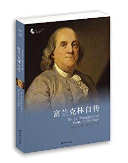

          
            
**2018.11.07**

很少读到自己写的传记，而且还大大贬损自己，对自己闪电实验一句话带过。
<h2>2018.05.28（周一）</h2>
<h3>《富兰克林自传》 - 01</h3>
>而富兰克林则是在夕阳无限好的晚年写的，而且是写给自己的儿子看的。相比之下，我们的一些名人总喜欢美化自己，文过饰非，甚至对众人皆知的失节行为在回忆录和自传中只字不提，仿佛从来没有发生过一样。这种欺世盗名的做法怎么能唤起人们的敬仰之情呢？

人非圣贤，孰能无过，富兰克林把这些人所不知的不光彩的事儿亮出来，目的是要警示后人：他跟自己的一些朋友不同的是，他能知错改错，才有日后的成功。

自传写给儿子，而且敢于在自己功成名就的时候写自己的丑事
>自传

我的几个哥哥都当学徒，干着不同的行当。我父亲有意把我这第十个儿子当作什一税奉送给教会当差，所以八岁那年，就让我上了文法学校。

十一税
>虽然我口口声声说这项工作如何有用，但我父亲说不诚实有何用，说得我心服口服。

心服口服
<h2>2018.05.29（周二）</h2>
<h3>《富兰克林自传》 - 02</h3>
>由于我嗜书成癖，终于使我父亲决定让我做一名印刷工，尽管他已经有一个儿子（詹姆斯）从事那种行当。

喜欢书，去跟着哥哥做印刷工
>我喜欢这个职业远远胜过喜欢父亲的职业，但仍然渴望去海上闯荡。为了预防那种爱好所产生的可怕后果，我父亲迫不及待地让我在我哥哥手下当学徒。

一直想去海上闯荡
>没用多久，我的手艺就大有长进，成了哥哥的得力助手。这时候，我已经能接触到一些更好的书了。由于认识了几个书商的学徒，我有时候就能借到一本小书，我看书非常小心，很快就能干干净净地归还。书要是晚上借的，第二天一早必须归还，以免被以为丢失或缺货，我往往在自己的屋子里开夜车赶着读。

书一定要借着读
>这种好争辩的禀性容易演化成一种恶习，因为反驳必然要将这种恶习付诸实践，结果惹得一起的人常常感到极不痛快，因为这样一来，除了把交谈搅黄，在本来可以建立友谊的地方，反而产生了厌恶，甚至敌意。

争辩容易产生敌意
>我认为，有时候他驳倒我，与其说靠过硬的道理，不如说凭流利的口才。分手的时候，问题仍然没有解决，一时又见不上面，于是我坐下来把自己的论据付之笔墨，誊清之后，给他寄了过去。他回信答复，我又写信回驳。这样一来二去，交换了三四封信，我父亲碰巧发现了我的文稿，并看了一遍。他没有管讨论的问题，只是趁机给我谈了谈文笔，说尽管就拼写和标点的正确（我把它归功于印刷所）而言(26)，我比对手强，但在文笔的优雅、章法的严谨、表达的明晰方面差了一大截，并且一一举例印证，让我心服口服。

我发现他的话十分公正，从此以后就更加注意文笔，下定决心努力改进。

父亲做得很好，不挑刺，帮着修改和点评
>无论读书还是做练习，时间只能定在晚上，下班后或早上上班前；要么就是礼拜天。

抓紧时间读书
>每当提出可能有争议的观点时，我从来不用“肯定地”，“无疑地”，或别的使一种意见有武断气息的字眼；而宁可说，我心想，我恐怕一件事情是如此这般，由于某种理由，在我看来，或我倒认为它如何如何，或者我想象事情如何如何，或者如果我没有弄错的话，事情就是这样。

如何提出有争议观点
>由于交谈的主要目的是提供信息或者获取信息，使人心悦或使人信服，所以我希望善意明达之人不要以武断自负的方式说话，而使行善的力量减弱，原因是用这种方式往往使人反感，容易造成对立，使我们专靠语言达到的这些目的——即提供或获取信息或者提供或获取快乐——一一泡汤：因为如果你要提供信息，在你提出自己的见解时，一种武断教条的态度可能招致反驳，也阻碍了坦诚的关注。

如何交谈
>一发现我要离开他了，他便使心眼儿不让镇上别的任何印刷所用我，为此东跑西颠，到每一个老板跟前游说，这样一来，谁也不肯给我事做。

哥哥排挤
>于是我把一部分书卖了，凑了一点钱，然后就被偷偷地送上了船，我们一路顺风，不出三天工夫，我发现已经到了纽约，离家快三百英里了，一个十七岁的孩子，既没有带给任何人的推荐信，也没有一个认识的人，囊中又是十分羞涩。

去费城找印刷工作
>他把我介绍给他儿子，他儿子待我很有礼貌，请我吃了一顿早饭，但却告诉我，眼下他不缺人手，因为前不久刚雇了一个。不过最近城里又开张了一家印刷所，老板姓凯默(55)，说不定他会雇我；要是不行，他欢迎我在他家里住下，先给我找一点零活儿干着，等找到正式一点的工作再说。

人真是好啊
>布雷福德也不透露自己是另一位印刷商的父亲，听到凯默说他指望不久就把大部分生意揽到自己手里，便问了一些巧妙的问题。提出几点小小的怀疑，引诱他说明他的全部想法，他依仗什么势力，打算怎么开展业务等等。

我站在旁边，听了个一字不漏，立马就看出他们俩一个是老狐狸，一个是嫩雏儿。布雷福德把我留给了凯默，当我告诉他那老头儿是谁的时候，他大吃了一惊。

老狐狸，套人家的话
>当时的纽约总督伯内特(62)，也就是伯内特主教的儿子，从船长那里得知乘客中有一个青年带了很多书，便希望船长带我去见他。

被总督青睐
>动用弗农的这笔钱是我一生中最早犯的大错之一。这件事表明：我父亲认为我太年轻不能经管重大事业的判断不无道理。

拿另一个哥哥的前借给赌博的朋友
>我交给他一个小型印刷所必需设备的清单，我估算大约值一百英镑。他欣然同意了，但又问我，要是我亲自到英国现场挑选铅字，保证样样东西质量上乘，这样岂不是更有好处。他说，这样一来，你可以在那里结交一些人，在图书销售和文具买卖上建立通信联系。

被坑去英国
>身为一个总督，竟然玩这种下三烂的把戏，卑劣地捉弄了一个无知的穷孩子，这叫我们作何感想！他已经养成了这种习惯。

这种人损人不利己
>我也渐渐淡忘了与里德小姐的约定，仅仅给她写过一封信，告诉她一时半会儿是回不去的。这是我一生的又一个重大错误，如果我能再活一遍，我希望能够改正。

和有婚约的里德小姐关系淡了
>我有一个干印刷的工友，每天早饭前喝一品脱，早饭时吃面包、奶酪，又喝一品脱；早饭和午饭之间再喝一品脱；吃午饭时又来一品脱；下午六点左右再来一品脱，歇工以后还要来一品脱。我认为这是一种令人深恶痛绝的习惯。但是他以为干活要劲大，劲大的啤酒少不了。、

印刷工人一天的伙食真好啊
>里德小姐接到我的信后，她的亲友对我的回来有理由感到绝望，于是劝她另嫁他人，这样，就在我去英国期间，她和一位姓罗杰斯的陶工结了婚

回费城发现里德小姐嫁人了
<h2>2018.05.30（周三）</h2>
<h3>《富兰克林自传》 - 03</h3>
>德纳姆先生在清水街开了一家商店，我们把百货陈列出来，我兢兢业业打理生意，学习记账，没有多长时间就成了营销专家。

跟着德纳姆先生开百货店，遇到了父亲一样的人
>我忘了德纳姆先生得的是什么病。他缠绵病榻很久很久，最后还是走了。他在口头遗嘱里给我留下一笔小小的遗产，算是对我关爱的表示，他把我又扔进了这个茫茫的世界。

德纳姆先生去世，留给富兰克林一些遗产
>梅瑞狄思晚上如约过来了，我们商量了一下我的事情。他早已对我极为敬重，所以不愿意我离开印刷所后他还赖在那里。我开始有了回老家的想法，他劝我还是打消这种念头。他提醒我凯默已经到了资不抵债的地步，债主们开始惶惶不安，他的文具店也经营不善，常常为了得到现款而做无利销售，还往往赊销而不入账。所以他的破产是不可避免的；这样我就可以乘虚而入，从中渔利。我说问题就是缺钱。于是他告诉我，他父亲(114)对我评价极高，他们俩曾议论过这事，听他父亲的口气，他可以断定如果我肯跟他合伙，他父亲会垫钱支持我们。他说，我跟凯默的合同春天就到期了。到时候我们可以从伦敦购进印刷机和铅字：我心里清楚我不是个大工匠。要是您愿意，你出技术，我出资本；所得利润咱们五五分成。

回到凯默那里打工，帮梅瑞狄斯戒酒，梅瑞狄斯父亲帮二人开印刷所
>新泽西的生意搞到手了，为此我设计了一台铜板印刷机，这在美洲还是第一次见到。为了印钞票我还刻了一些装饰花纹和格子图案。

没想到日后自己被印到钞票上
>我把我的大多数聪明能干的相识组织成了一个俱乐部，以便相互促进，共同提高，我们管它叫“共图社”

俱乐部延续的时间差不多也这么长，而且是本地区当时存在的最好的科学、道德、政治学校。因为我们的问题总是先宣读，后讨论，中间相隔一个礼拜，这就逼着我们围绕不同的题目聚精会神地读书

组建了一起读书的共同社
>他一走，我就再去找我那两位朋友；我不想造成一种厚此薄彼的不良印象，我从每个人那里只拿了我所需的一半，还清了公司的债务，以我的名义继续经营生意，并刊登广告宣布合作终止。我想这是1729年或是这一年前后的事情。

梅瑞狄斯撤股，借钱自己接手整个印刷所
>弗雷太太让我们先讲好条件，我告诉她，我希望他们的女儿带过来的陪嫁能还清印刷所剩余的债务，我相信当时不会超过一百英镑。她给我传话说，他们拿不出那么多数目。我说他们可以在贷款处抵押房子嘛，几天后回话说他们不同意这门亲事

开始找媳妇
>在此期间，青春欲火势不可遏，因此逼我常常与萍水相逢的下流女人厮混，这就难免要花钱，会惹出麻烦，还会染上一种病(147)，不断危及我的健康，这是我最惧怕的，不过万幸我逃过了这一劫。

出去找下流女人
>尽管困难重重，我们豁出去了，1730年9月1日我娶她为妻。(148)我们担心的那些麻烦事一件也没有发生，事实证明她是个贤内助，照看店面，帮了我很多忙，我们齐心协力，事业兴旺，互相努力，让对方幸福。这样我算尽力改正了那个重大的错误。

终于娶到了里德小姐
>提出任何一项也许会被人认为能使提倡者的声誉高出自己的四邻一丁点儿的有用的计划，而又需要四邻帮助来完成这一计划时，如果此人摆出一副该计划发起人的面孔，那就太不识时务了。因此我尽量把自己放在不显眼的地方，声称那是几个朋友的计划，是他们要求我跑跑龙套，把它提交给他们认为爱读书的人的。这样一来，我的事情就进展得顺利多了。

对自己有利的事情，不要表现出是自己主动要干的，要表现出自己在跑龙套
>不过还是注意一下奢侈是怎样对我的原则不管不顾、潜入我的家庭，并且跬步寸进的吧。一天早晨，我被叫去吃早饭时，我发现饭盛在一只瓷碗里，里面还有一只银勺子。这些东西是我妻子瞒着我为我买的，花了她老鼻子的钱，二十三先令啊，对此她没有别的借口可以辩解，只能说，她认为她的丈夫像别的任何邻里一样，应该有一只银勺子和瓷碗。这是我们家头一次出现银器和瓷器。后来数年内，随着我们家财富的增加，这类东西也渐渐多了起来，价值达到了几百英镑。

一直保持简朴，妻子买了一只银勺子和瓷碗就觉得很奢侈
>我把当时觉得必要或可取的美德归入十三个名目，每一个名目附上一条简短的规戒，充分表达我所下定义的范围。

这些美德名目及其规戒是：

一，节制。饭不可吃胀。酒不可喝高。

二，缄默。于人于己不利的话不谈。避免碎语闲言。

三，秩序。放东西各归其位，办事情各按其时。

四，决心。决心去做该做的事情，做就做到心想事成。

五，节俭。不花于己于人没有好处的闲钱，杜绝浪费。

六，勤奋。珍惜时光。手里总忙有益之事。剪除一切无谓之举。

七，诚信。不害人，不欺诈。思想坦荡，公正；说话实事求是。

八，正义。不损人利己，伤天害理的行为永不沾边，利公利民的应尽义务切勿放手。

九，中庸。避免走极端。忍让化冤仇。

十，清洁。身体、衣着、居所，不许不干不净。

十一，平静。不可为小事、常事或难免之事搅乱了方寸。

十二，贞洁。少行房事，除非为了身体健康或传宗接代；千万不可搞得头脑昏沉，身体虚弱，或者伤害自己或他人的平静或声誉。

十三，谦卑。效法耶稣和苏格拉底。

富兰克林的十三条美德
>实际上，在我们的性情中最难制服的也许就是骄傲了，你尽可以千方百计地将它伪装，跟它拼搏，把它打翻在地，掐住它的脖子，将它狠狠羞辱一顿，但就是弄不死它，一有风吹草动，它又窥间伺隙表演一番。在这本传记里你也许会常常看见它。哪怕我自以为已经彻彻底底战胜了它，我也许又该为自己的谦卑而居功自傲了。

对骄傲的描述太精辟了
>我在1733年就开始学习外语。我很快就精通了法语，能够轻松地看法文书。然后我又学了意大利语。

后来我又下了一点苦功学西班牙语，也能够读原著了。

语言天才
>在返家途中，我专门到新港去看望哥哥，那时候他连家带印刷所都安置在那里。我们已经冰释前嫌，哥儿俩相见亲切而又动情，他的健康正在迅速恶化，他担心大限不远了，所以要求我，万一他死了，就把他的刚刚十岁的儿子带回家，扶养大后让他从事印刷业。

不到生命最后，很难冰释前嫌
>1736年，我失去了一个儿子(7)，一个四岁的漂亮男孩，死于由常见的渠道染上的天花。长期以来，我悔恨万分，现在仍然悔恨没有给他接种疫苗；

天花疫苗
>我于1736年被选为议会秘书，这是对我的第一次提拔。

开始从政
>我不喜欢这位新议员的反对。此公是位绅士，家境富裕，教育良好，才气不凡，这些到时候很可能使他在议会中形成大气候，后来情况果真如此。但我也不打算低声下气以讨得他的欢心，而是过了一段时间采用了这么一种另类办法。听说他的藏书中有一件稀世珍本，我便给他写了个条子表达了一睹为快的渴望，并要求他惠允我借阅数日。他立即派人把书送过来；大约一个礼拜后我将书归还，又附了一张条子，表达了强烈的感恩之请。我们再次在议会里见面时，他主动跟我攀谈（这是他前所未有的举动），而且很有礼貌。此后他时时处处都表示乐意为我效劳，最后我们成了莫逆之交，我们的友谊一直延续到他去世的那一天。这又一次证实了我学的那句至理名言，谁若一次施恩与你，必将二次施恩与你，其乐意之情为受恩于你者所不及也。这也表明冤仇宜解不宜结，冤冤相报弊无穷。

你不喜欢的人，不一定就是坏人，可能还会成为朋友
>一个穷寡妇当家，巡夜保护的全部家产也许不值五十英镑，而一名富商铺子里却有数千英镑的货物，二者却缴纳同样数目的税款。总而言之，我提出了一条更加有效的巡夜制度，那就是雇用合适人选常年从事这项工作，我还提出了一种补助这项开销的更加公平的办法，那就是课税多少应与财产的多少挂钩。

纳税与财产挂钩
<h2>2018.05.31（周四）</h2>
<h3>《富兰克林自传》 - 04</h3>
>现在就在我撰写本文的时候，尽管离它的成立已经五十余年了，我第一个组建的名叫“联合消防队”的机构仍然存在，而且非常兴旺，虽说除了我和一位比我大一岁的人，它的初创成员皆已作古。

创建消防队
>由于常听他的布道，我逐渐能轻而易举地将他新作的布道文与在旅行的过程中常常宣讲的布道文区分开来。后者由于屡屡重复宣讲，不断得到改进，以致声音抑扬顿挫，百转千回，达到了炉火纯青的境界，一个人哪怕对主题不感兴趣，光听演讲也觉得心旷神怡，其感受就像听了一段优美的音乐一样。这就是巡回宣教士的优势，为固定宣教士望尘莫及，因为后者无法通过如此多的演练来大力改进自己的讲道。

和擅长步道的教士学演讲
>由于卡罗来纳的合伙生意十分成功，我大受鼓舞，便想一鼓作气，再接再厉，继续往下搞，于是提拔了几名表现好的工人，让他们在各个殖民地建立印刷所，条件与卡罗来纳的一样。(21)其中大多数都搞得不错，等到我们六年的协议期满后，他们都有能力买下我的铅字；继续独立经营，养活好几个家庭。

让自己的伙计去外面开分店，再交给人家独立经营
>合伙经营往往产生口角，闹得不欢而散，但我在这一方面十分愉快，我的合伙生意从进展到结束都一团和气；我想这主要归功于采取了预防措施，我们在条款中把一切都规定得明明白白：彼此该做什么，想得到什么，没有任何可以争执的余地，因此我特意向所有经营合伙生意的人推荐这种预防措施，因为在签订合同时无论合伙双方多么互敬互信，但在生意的打理和负担上总会有不够平等的想法，于是难免产生一些小小的猜忌和厌恶，这就往往造成了友谊破裂，关系断绝，也许还少不了对簿公堂，还造成其他种种不愉快的后果。

提前想好所有可能的问题
>如果按时间顺序，我前面就应该提到这么一件事情，那就是我在1742年发明了一种敞口壁炉，这种火炉不仅能使房间更加暖和，而且可以节省燃料，因为新鲜空气一进来就被加热了。

发明高效壁炉
>他从小就受到这方面的训练，他父亲（我听说）的习惯就是饭后让孩子们围着饭桌互相争论，作为他的余兴节目。不过我认为这种做法不太明智，因为经过我长期的观察；这些爱争长论短、反驳辩难的人做事一般都不走运。他们有时候能获得胜利，但永远也得不到友善，而友善对他们则更有用处。

不要练习争论
>仓皇逃窜的军士，由于未受到追击，便投奔到邓巴的大营里来，他们带来的惊恐立即扰乱了邓巴的军心。尽管他现在还有一千多人，打败布雷多克的敌人把法国人和印第安人加在一起顶多也不超过400人(103)；他非但不引军向前，奋力苦战挽回一些面子，反而下令将辎重全部销毁，以便腾出更多的马匹帮助他火速逃回居民区，而且也减少拖运的累赘。在那里他接到弗吉尼亚、马里兰和宾夕法尼亚各地总督的请求，要他屯兵边境，好为居民提供一定的保护；但他仍然马不停蹄仓皇撤退，穿越这些地区，一直退到费城才认为自己平安无事了，因为那里的居民可以保护他了。这件事的前前后后使我们美洲人第一次产生了怀疑，我们一贯认为英国正规军英勇超群，看来这种想法失之浮夸，缺乏充分的根据。

开始怀疑英军能力
>我招募兵源没费多少周折，很快就有560人归我指挥了。我儿子在上次对加拿大作战时招募的军队中当过军官，现在出任我的副官，对我帮助极大。

儿子跟随身边
>这件事让我有机会注意到，人们专心致志地做事的时候，往往最为满足。因为他们干活的那几天，个个心平气和，欢天喜地；意识到白天活儿干得称心，晚上就过得快意！如果一天闲暇无事，他们就变得桀骜不驯，吵闹不休，总是鸡蛋里头挑骨头，不是嫌猪肉肥，就是嫌面包硬，总之，脾气一直很坏；这使我想起一位船长，他的原则就是让水手们一直忙忙碌碌；有一回他的大副告诉他什么事都干完了，再也没有让他们可忙活的了；噢，他说，那就让他们洗刷铁锚吧。

人一闲下来就闹事
>我的书之所以声名鹊起，引起普遍关注，是因为达里巴尔和德洛尔两位先生在马尔利把书中建议的从云层吸引闪电的实验做成功了(138)，这就引起了满天下的关注。

引雷电实验
>致富之路

懒惰向我们抽的税就要多得多了。怠惰由于使人生病，从而绝对缩短了生命。怠惰犹如铁锈，耗损精力快过劳累。

懒惰

***最近喜欢的诗文***
>以前只听说过逍遥游开头的名句，自己读了以后，才发现后面更有道理
逍遥游节选
且夫水之积也不厚，则其负大舟也无力。覆杯水于坳堂之上，则芥为之舟，置杯焉则胶，水浅而舟大也。
风之积也不厚，则其负大翼也无力。故九万里，则风斯在下矣，而后乃今培风；
背负青天，而莫之夭阏者，而后乃今将图南。

**个人微信公众号，请搜索：摹喵居士（momiaojushi）**

          
        